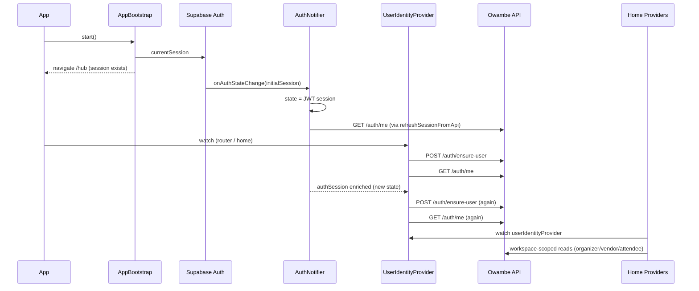
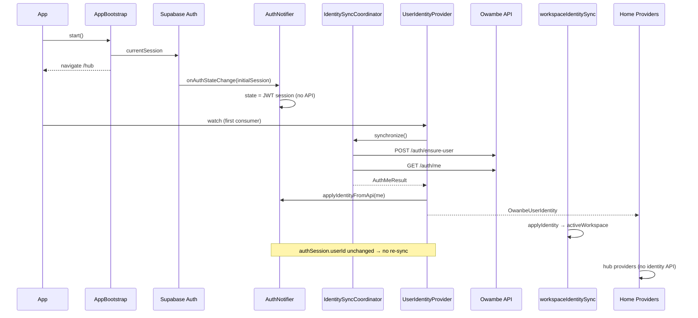
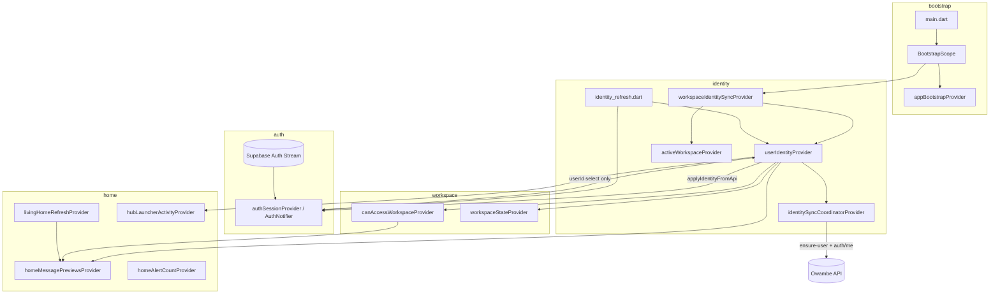

# Identity Initialization & Startup Audit

**Date:** 2026-07-14  
**Scope:** App launch → Boot Manager → Supabase → AuthNotifier → Identity Provider → Workspace Sync → Home/Activity/Profile  
**Constraint:** No auth architecture redesign; eliminate duplicate identity API calls at the root.

---

## Executive Summary

Duplicate `POST /auth/ensure-user` and `GET /auth/me` requests during startup were **accidental**, not intentional. Two independent code paths both performed full identity synchronization:

1. **`AuthNotifier`** — on `initialSession` / sign-in via `refreshSessionFromApi()` and `completeUniversalAuth()`
2. **`UserIdentityNotifier`** — on every `authSessionProvider` change via `_loadIdentity()`

These ran **in parallel** and **re-ran** when auth session was enriched after the first `/auth/me` completed, producing 2–4 API calls per cold start. Parallel failures (e.g. `Connection reset by peer` on one call while another succeeded) caused the brief **error-then-recovery** UI flash on Home/Activity.

**Fix:** Single authoritative sync via `IdentitySyncCoordinator`, owned exclusively by `userIdentityProvider`. AuthNotifier now publishes Supabase session only; API sync runs once.

---

## 1. Startup Sequence Diagram

### Before (duplicate paths)

### After (single sync)

---

## 2. Provider Dependency Graph

**Circular dependency resolved:** `activeWorkspaceProvider` does not trigger identity reload. `userIdentityProvider` watches `authSessionProvider.select((s) => s?.userId)` so enriching session fields after sync does not re-trigger `_loadIdentity()`.

---

## 3. Request Graph

| Phase | Trigger | ensure-user | auth/me | Notes |
|-------|---------|-------------|---------|-------|
| **Cold start (before)** | `initialSession` listener | 0 | 1 | `refreshSessionFromApi` |
| | `userIdentityProvider.build` | 1 | 1 | First watch |
| | `authSession` enrichment | 1 | 1 | Rebuild on full session change |
| | **Total** | **2** | **3** | Accidental |
| **Cold start (after)** | `userIdentityProvider.build` | 1 | 1 | Single flight via coordinator |
| | **Total** | **1** | **1** | Expected |
| **Email sign-in (before)** | `completeUniversalAuth` | 1 | 1 | |
| | `userIdentityProvider` rebuild | 1 | 1 | |
| | **Total** | **2** | **2** | Accidental |
| **Email sign-in (after)** | `completeUniversalAuth` | 0 | 0 | Publishes JWT session only |
| | `userIdentityProvider` rebuild | 1 | 1 | |
| | **Total** | **1** | **1** | Expected |
| **Pull-to-refresh Home (before)** | `refreshLivingHome` | 1 | 1 | `invalidate(userIdentityProvider)` |
| **Pull-to-refresh Home (after)** | `refreshLivingHome` | 0 | 0 | Identity not invalidated |
| **Onboarding complete (before)** | `refreshSessionFromApi` + `refresh()` | 2 | 2 | Double call |
| **Onboarding complete (after)** | `userIdentityProvider.refresh()` | 1 | 1 | Single forced sync |

### Home / Activity / Profile (unchanged — no identity API)

| Provider | Depends on identity | Own API calls |
|----------|--------------------|---------------|
| `livingHomeInvitationsProvider` | `userIdentityProvider.valueOrNull` | Customer tickets API |
| `hubOrganizerEventsProvider` | `canAccessWorkspaceProvider` | Customer events API |
| `hubVendorDashboardProvider` | `canAccessWorkspaceProvider` | Vendor finance/events API |
| `homeMessagePreviewsProvider` | Aggregates above | None (derived) |
| `hubLauncherActivityProvider` | Aggregates above | None (derived) |
| `homeProfileTab` | `userIdentityProvider` watch | None |

Activity tab errors that surfaced `ensure-user` were **identity sync failures**, not Activity-specific logic.

---

## 4. Duplicate Request Analysis

### Root causes

| # | Root cause | Severity | Fixed |
|---|-----------|----------|-------|
| 1 | **Dual sync owners:** `AuthNotifier.refreshSessionFromApi` and `UserIdentityNotifier._loadIdentity` both called `/auth/me` | Critical | Yes |
| 2 | **`completeUniversalAuth` duplicated `_loadIdentity`:** ensure-user + fetchMe in auth, then again in identity | Critical | Yes |
| 3 | **`initialSession` listener** fired `refreshSessionFromApi` on every cold start while identity provider also synced | Critical | Yes |
| 4 | **`userIdentityProvider` watched full `authSessionProvider`:** session enrichment after `/auth/me` changed object → full rebuild → second sync | High | Yes (`select userId`) |
| 5 | **`refreshLivingHome` invalidated `userIdentityProvider`** on pull-to-refresh | Medium | Yes |
| 6 | **Onboarding screens** called `refreshSessionFromApi` then `userIdentityProvider.refresh()` | Medium | Yes |
| 7 | **No single-flight guard:** parallel widgets could start concurrent syncs | High | Yes (`IdentitySyncCoordinator`) |
| 8 | **Legacy `IdentityPlatform.initialize` → `fetchMe`** (portal OAuth only) | Low | Not in universal path |

### Why UI flashed error then recovered

Parallel `ensure-user` requests against a dev API (restarts, `adb reverse` drops, Postgres blips) could produce:

- Request A: `Connection reset by peer` → `userIdentityProvider` → **error state**
- Request B: succeeds → session enriched → **rebuild** → success

This looked like recovery but was a **race between duplicate callers**, not resilient design.

---

## 5. Provider Audit Answers

| Provider / Service | Why it exists | Created when | Who creates it | Should run once? | Multi-widget risk | Riverpod rebuild risk | Hot restart | Retries |
|--------------------|---------------|--------------|----------------|------------------|-------------------|----------------------|-------------|---------|
| `appBootstrapProvider` | Cold-start orchestration, splash routing | First `BootstrapScope` post-frame | `BootstrapScope` | Yes (`_started` guard) | No | No after ready | Idempotent `start()` | No |
| `authSessionProvider` | Lightweight session for router/guards | ProviderScope init | Riverpod | N/A (state holder) | Single instance | Rebuild on Supabase events | Re-subscribes listener | No |
| `userIdentityProvider` | **Authoritative** full identity + API sync | First `watch`/`read` | Router, Home, workspace providers | **Yes** per sign-in | Single AsyncNotifier | Only on `userId` change now | Re-runs one sync | Manual `refresh()` only |
| `identitySyncCoordinatorProvider` | Single-flight ensure-user + auth/me | First identity sync | `UserIdentityNotifier` | **Yes** per session | Single coordinator | Cached Provider | New container → one sync | Coalesces concurrent |
| `workspaceIdentitySyncProvider` | Apply server workspace to local | `BootstrapScope.build` | Bootstrap | Listener only | Mounted once | Stable | Re-listens | No |
| `activeWorkspaceProvider` | UI workspace context | First read | Workspace switcher, identity sync | N/A | Single Notifier | Pref + identity apply | Restores prefs | No |
| `livingHome*Provider` | Home section data | Tab mount / refresh | Home widgets | Per refresh tick | autoDispose per tab | `livingHomeRefreshProvider` bump | Same as cold start | No identity retry |
| `homeMessagePreviewsProvider` | Activity tab messages | Activity tab in IndexedStack | `HomeActivityTab` | Per provider lifecycle | autoDispose | Parent refresh counter | Same | No |

---

## 6. Files Modified

| File | Change |
|------|--------|
| `mobile/lib/identity/identity_sync.dart` | **New** — single-flight `IdentitySyncCoordinator` |
| `mobile/lib/identity/identity_refresh.dart` | **New** — bridge for explicit refresh without circular imports |
| `mobile/lib/identity/identity_provider.dart` | Authoritative sync; `select(userId)`; applies auth session after sync |
| `mobile/lib/auth/auth_notifier.dart` | Removed startup/sign-in API calls; `applyIdentityFromApi`; `restoreSupabaseSession` |
| `mobile/lib/features/home/providers/living_home_providers.dart` | Removed `invalidate(userIdentityProvider)` from pull-to-refresh |
| `mobile/lib/portals/attendee/screens/attendee_onboarding_screen.dart` | Removed duplicate `refreshSessionFromApi` |
| `mobile/lib/features/identity/screens/organizer_onboarding_screen.dart` | Removed duplicate `refreshSessionFromApi` |
| `mobile/lib/features/vendor/screens/vendor_onboarding_screen.dart` | Removed duplicate `refreshSessionFromApi` |

**Not modified (per constraints):** Boot Manager, Universal Identity UI, router architecture, backend APIs.

---

## 7. Validation Results

### Static / automated

| Check | Result |
|-------|--------|
| `flutter analyze` (changed files) | Pass (no errors; pre-existing infos only) |
| `flutter test` | **13/13 passed** |
| Circular provider dependency | None — `userId` select breaks auth enrichment loop |
| Boot Manager | Unchanged — verified no defect requiring change |

### Expected runtime (verify on device)

| Scenario | ensure-user | auth/me |
|----------|-------------|---------|
| Cold start with saved session → `/hub` | 1 | 1 |
| Email sign-in → `/hub` | 1 | 1 |
| Pull-to-refresh Home | 0 | 0 |
| Switch Activity tab | 0 | 0 |
| Hot restart (same session) | 1 | 1 |
| Process death + relaunch | 1 | 1 |
| Onboarding complete | 1 | 1 (forced `refresh()`) |

### Device verification steps

1. Start API: `cd services/api && npm run start:dev`
2. USB: `adb reverse tcp:8080 tcp:8080`
3. Full restart app (not hot reload)
4. Watch API logs for `/auth/ensure-user` and `/auth/me` — expect **one each** before Home renders
5. Switch Home / Activity / Profile — no additional identity calls
6. Pull-to-refresh Home — no ensure-user / auth/me
7. Hot restart — exactly one pair again

---

## 8. Authoritative Sync Contract

After this audit:

1. **Only `UserIdentityNotifier`** (via `IdentitySyncCoordinator`) may call `ensure-user` + `auth/me` during normal app operation.
2. **`AuthNotifier`** publishes Supabase JWT session and accepts `applyIdentityFromApi` after sync — it does not independently synchronize.
3. **Explicit refresh** (onboarding, `refreshSessionFromApi`) delegates to `userIdentityProvider.refresh()` through `identity_refresh.dart`.
4. **Downstream providers** read `userIdentityProvider` / `authSessionProvider` — they never initiate identity sync.
5. **Pull-to-refresh** refreshes workspace data only, not identity.

---

## 9. Residual Notes

- **Legacy portal OAuth** (`IdentityPlatform` / `IdentityRepository.fetchMe`) may still call `/auth/me` on portal-specific Google flows. Universal auth (email + universal Google) uses the single path above.
- **Connection reset by peer** on the sole sync call will still show an identity error until the user retries or connectivity recovers — this is correct; the previous “self-recovery” was the duplicate-request race.
- **Activity tab** will show identity errors if sync fails; fixing raw exception overflow in UI is out of scope for this audit.

---

*End of audit.*
