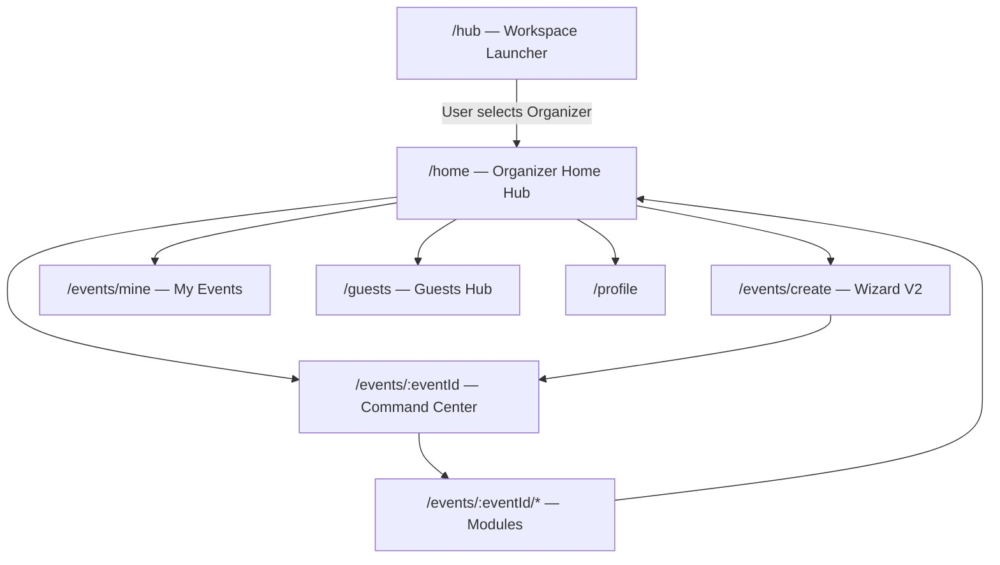

# Organizer Workspace Navigation Audit

**Date:** 2026-07-14  
**Scope:** Organizer (Customer) workspace routing — prevent unintended redirects to `/hub`  
**Constraint:** No auth, identity, boot manager, launcher, UI, or new screen changes

---

## Executive Summary

Clicking **Create event** (and other organizer shell routes) navigated correctly to `/events/create`, but `_unifiedIdentityRedirect` in `app_router.dart` did not recognize Event OS paths as organizer workspace routes. The catch-all `return ExperienceRoutes.hub` sent users back to the Workspace Launcher.

**Fix:** Centralized organizer path recognition in `EventRouteRegistry.isOrganizerWorkspacePath()` and wired it into `ExperienceRoutes.workspaceFromPath()`. Future event modules under `/events/:eventId/*` are automatically recognized without hardcoding individual paths.

---

## Root Cause

### Redirect logic (before)

```dart
final ws = ExperienceRoutes.workspaceFromPath(loc);
if (ws != null) return null;
// ...
return ExperienceRoutes.hub;  // catch-all
```

### Workspace detection (before)

```dart
static ExperienceWorkspace? workspaceFromPath(String location) {
  if (location.startsWith('/attendee')) return ExperienceWorkspace.attendee;
  if (location.startsWith('/organizer') || location == '/home') {
    return ExperienceWorkspace.organizer;
  }
  if (location.startsWith('/vendor')) return ExperienceWorkspace.vendor;
  return null;
}
```

| Path | Registered in GoRouter | Recognized as organizer | Result |
|------|------------------------|-------------------------|--------|
| `/home` | Yes (shell) | Yes | OK |
| `/events/create` | Yes (shell) | **No** | Redirect → `/hub` |
| `/events/mine` | Yes (shell) | **No** | Redirect → `/hub` |
| `/guests`, `/profile` | Yes (shell) | **No** | Redirect → `/hub` |
| `/events/:eventId` | Yes | **No** | Redirect → `/hub` |
| `/events/:eventId/guests` | Yes | **No** | Redirect → `/hub` |
| `/organizer/onboarding` | Yes | Yes | OK |

`PortalRoutes.roleFromProtectedPath()` already used `EventRouteRegistry.isShellPath()` and `isEventModulePath()`, but the universal identity redirect did not — creating a mismatch between portal access rules and hub-first redirect guard.

---

## Routing Architecture

### Organizer navigation stack



### Layer responsibilities

| Layer | Role |
|-------|------|
| `EventRouteRegistry` | Canonical paths; `isOrganizerWorkspacePath()` |
| `EventNavigator` | Navigation API (`goCreateEvent()`, etc.) |
| `customerShellRoute()` | StatefulShellRoute with organizer tabs |
| `ExperienceRoutes.workspaceFromPath()` | Maps path → workspace for guards |
| `_unifiedIdentityRedirect()` | Allows recognized workspace paths; catch-all only for unknown routes |
| `experienceWorkspaceRouteGuard()` | Activation/onboarding checks per workspace |

### Centralized recognition (after)

```dart
// EventRouteRegistry
static bool isOrganizerWorkspacePath(String location) {
  final path = location.split('?').first;
  return isShellPath(path) || isEventOverviewPath(path) || isEventModulePath(path);
}

// ExperienceRoutes
if (location.startsWith('/organizer') ||
    EventRouteRegistry.isOrganizerWorkspacePath(location)) {
  return ExperienceWorkspace.organizer;
}
```

**Coverage:**

| Category | Mechanism | Examples |
|----------|-----------|----------|
| Shell tabs | `isShellPath()` | `/home`, `/events/create`, `/events/mine`, `/guests`, `/profile` |
| Event overview | `isEventOverviewPath()` | `/events/evt_lagos_owanbe_2026` |
| Event modules | `isEventModulePath()` | `/events/:id/guests`, `/tickets`, `/edit`, `/check-in`, `/live`, `/day`, … |
| Legacy organizer | `startsWith('/organizer')` | `/organizer/onboarding`, `/organizer/events/new` |

New modules added under `/events/:eventId/<module>` are recognized automatically via `isEventModulePath()` regex — no router guard changes required.

---

## Files Modified

| File | Change |
|------|--------|
| `mobile/lib/portals/customer/router/event_route_registry.dart` | Added `isEventOverviewPath()`, `isOrganizerWorkspacePath()` |
| `mobile/lib/router/experience_routes.dart` | `workspaceFromPath()` delegates to `EventRouteRegistry.isOrganizerWorkspacePath()` |
| `mobile/test/organizer_workspace_routes_test.dart` | **New** — registry and workspace mapping tests |

**Not modified:** Auth, Universal Identity, Boot Manager, Workspace Launcher, organizer UI, event wizard screens, NestJS API.

---

## Validation

### Automated

| Check | Result |
|-------|--------|
| `flutter test` | **19/19 passed** |
| `flutter analyze lib/router lib/portals/customer/router` | No issues |
| `npm run build` (services/api) | **Exit 0** |

### Route regression matrix

| Flow | Path | Expected | Guard result (after) |
|------|------|----------|----------------------|
| Organizer Home | `/home` | Stay | `null` (allow) |
| Create Event | `/events/create` | Wizard V2 | `null` (allow) |
| My Events | `/events/mine` | My Events screen | `null` (allow) |
| Guests hub | `/guests` | Guests screen | `null` (allow) |
| Profile | `/profile` | Profile screen | `null` (allow) |
| Event dashboard | `/events/:id` | Command center | `null` (allow) |
| Event guests | `/events/:id/guests` | Guests module | `null` (allow) |
| Event tickets | `/events/:id/tickets` | Tickets module | `null` (allow) |
| Future modules | `/events/:id/check-in`, `/live`, `/edit` | Module screen | `null` (allow) |
| Workspace Launcher | `/hub` | Only when user navigates there | `null` (allow) |
| Unknown route | `/unknown` | Redirect to `/hub` | `/hub` (unchanged) |

### Manual (device)

After **full app restart**:

1. Workspace Launcher → enter **Organizer**
2. Tap **Create event** → Event Creation Wizard V2 (not `/hub`)
3. Complete or back → Organizer Home
4. Bottom nav: **My Events**, **Guests**, **Profile** — no hub redirect
5. Open an event → command center and modules load
6. **Home** in workspace chrome → returns to `/hub` only when explicitly tapped

---

## Regression Results

| Area | Status |
|------|--------|
| Attendee commerce routes | Unchanged — `/attendee/*` still maps to attendee workspace |
| Vendor workspace | Unchanged — `/vendor/*` still maps to vendor workspace |
| Public discovery `/events` | Not organizer workspace — public path handling unchanged |
| Legacy `/organizer/*` | Still recognized via prefix |
| Suspended workspace guard | Still redirects to `/hub` when workspace suspended (intentional) |

---

*End of audit.*
