# Event OS — Phase 3 Report

**Sprint:** Event Planning & Operations Workspace  
**Status:** Complete — STOP (await Phase 4 approval)

---

## Mission

Transform Event Desktop from a launcher into a **Planning Workspace** — the operating office where organizers answer:

1. What still needs to be done?
2. What is currently in progress?
3. What should I do next?

No new business modules. No duplicate routes. Orchestration only.

---

## 1. Planning Center Architecture

```
EventDesktop
├── EventDesktopHero (unchanged)
├── EventPlanningCenter          ← NEW primary surface
│   ├── Lifecycle stage banner
│   ├── Three-questions header (outstanding / in-progress / next)
│   ├── "Do next" CTA → existing module
│   ├── PlanningProgressRing     ← reused from command_center
│   ├── Event Readiness score    ← derived (replaces static health %)
│   ├── Smart checklist          ← from buildAiPlannerPlan().checklist
│   ├── Upcoming milestones      ← from buildAiPlannerPlan().timeline
│   ├── Outstanding tasks        ← from buildPlanningTasks() via snapshot
│   ├── Status cards             ← vendor / guest / ticket / finance
│   └── AI suggestions           ← from buildAiPlannerPlan().missingRequirements
├── Open a module (secondary)    ← Phase 1 launcher preserved
├── Quick actions
└── Recent activity + KPIs (tertiary)
```

### Data flow

```
eventPlanningWorkspaceProvider(eventId)
  ├── customerEventCommandProvider     → snapshot, tasks, progress
  ├── customerEventGuestsProvider      → guest RSVP / check-in counts
  ├── eventVendorCrmProvider           → vendor pipeline stages
  └── aiPlannerEventContextProvider
        └── buildAiPlannerPlan()       → checklist, timeline, AI gaps
              └── buildEventPlanningWorkspace()  → single orchestration model
```

**Key files:**

| Layer | Path |
|-------|------|
| Models + orchestration | `mobile/lib/portals/customer/planning/event_planning_models.dart` |
| Provider | `mobile/lib/portals/customer/planning/event_planning_workspace_provider.dart` |
| Deep-link navigation | `mobile/lib/portals/customer/planning/planning_module_navigation.dart` |
| UI | `mobile/lib/portals/customer/workspace/widgets/event_planning_center.dart` |
| Desktop integration | `mobile/lib/portals/customer/workspace/widgets/event_desktop.dart` |

---

## 2. Checklist Derivation Map

Checklist items are **never stored separately**. They are computed at read time from existing module data via `buildAiPlannerPlan()` → `_buildChecklist()`.

| Checklist label (examples) | Done when (source module) | Deep-link module |
|---------------------------|---------------------------|------------------|
| Confirm venue & date | `event.venue` set | Program |
| Set celebration budget | `inputs.budgetMinor > 0` (Budget provider) | Budget |
| Build guest list | `event.attendees` non-empty | Guests |
| Book catering / DJ / photo / décor | `event.vendors` approved by category | Vendor pipeline |
| Send invitations | guests exist | Invitations |
| Configure tickets / RSVP | `event.ticketTiers` non-empty | Tickets manage or Invitations |
| Publish celebration page | `event.status` published/live | Website |

Outstanding tasks from `buildPlanningTasks()` (command center) provide a second layer:

| Task | Source signal | Deep-link |
|------|---------------|-----------|
| Set event details | title + venue | AI Planner |
| Add guests | attendees / expectedGuests | Guests |
| Book vendors | approved vendor slots | Vendor pipeline |
| Configure tickets | ticket tiers | Ticket management |
| Send invitations | attendees | Invitations |
| Publish celebration | status published/live | Website |

---

## 3. Readiness Calculation Model

**Event Readiness Score** = arithmetic mean of 8 operational dimensions (0–100 each):

| Dimension | Weight in average | Signal source |
|-----------|-------------------|---------------|
| Guests | 1/8 | RSVP accepted / expected guests |
| Tickets | 1/8 | tiers configured + sales/capacity (public events) |
| Vendors | 1/8 | accepted+completed / total requests |
| Venue | 1/8 | venue + city populated |
| Timeline | 1/8 | AI planner timeline complete/due-soon ratio |
| Finance | 1/8 | budget set + outstanding within 15% |
| Checklist | 1/8 | AI checklist done ratio |
| Operations | 1/8 | published/live status |

Replaces the previous static "Health index" (`tasksCompleted / total`).

### Lifecycle stages (auto-derived)

```
Draft → Planning → Vendors Secured → Guests Invited → Tickets Live
  → Ready For Event → Live Event → Completed → Archived
```

Derived in `deriveEventLifecycleStage()` from:

- `CustomerEvent.status`
- `EventCommandCenterSnapshot` guest/vendor counts
- `VendorCrmSnapshot.stats`
- `List<CustomerGuestView>`

Planning progress ring still uses `computePlanningProgress(event)` from existing `customer_event_models.dart`.

---

## 4. AI Recommendation Integration

Reuses **existing** `buildAiPlannerPlan()` — no new AI engine.

`missingRequirements` surfaced in Planning Center with deep-links:

| Recommendation | actionRoute | Opens |
|----------------|-------------|-------|
| No vendors confirmed | `vendors` | Marketplace (event-scoped) |
| Guest list empty | `guests` | Guests module |
| Budget tight / location / guest count | — | AI Planner (fallback) |

"Do next" CTA priority:

1. First incomplete checklist item
2. Else first AI missing requirement with actionRoute
3. Else first outstanding `buildPlanningTasks()` item

---

## 5. Module Orchestration Diagram

```mermaid
flowchart TB
  subgraph Desktop["Event Desktop (Planning Workspace)"]
    PC[Planning Center]
    ML[Module Launcher]
  end

  subgraph Orchestrator["eventPlanningWorkspaceProvider"]
    CC[customerEventCommandProvider]
    GP[customerEventGuestsProvider]
    VC[eventVendorCrmProvider]
    AI[buildAiPlannerPlan]
    BW[buildEventPlanningWorkspace]
  end

  subgraph Modules["Existing Event OS Modules — unchanged"]
    G["/events/:id/guests"]
    V["/events/:id/vendor-pipeline"]
    T["/events/:id/tickets/manage"]
    B["/events/:id/budget"]
    M["/vendors?eventId="]
    P["/events/:id/ai-planner"]
    PR["/events/:id/program"]
    W["/events/:id/website"]
  end

  PC --> BW
  CC --> BW
  GP --> BW
  VC --> BW
  AI --> BW

  PC -->|deep-link| G
  PC -->|deep-link| V
  PC -->|deep-link| T
  PC -->|deep-link| B
  PC -->|deep-link| M
  PC -->|deep-link| P
  PC -->|deep-link| PR
  PC -->|deep-link| W

  ML --> Modules
```



### Status card → module mapping

| Card | Data source | Tap opens |
|------|-------------|-----------|
| Vendors | `VendorCrmSnapshot.stats` or `event.vendors` | Vendor pipeline |
| Guests | `customerEventGuestsProvider` / snapshot | Guests |
| Tickets | `event.ticketTiers`, `ticketsSold`, `revenueMinor` | Ticket management |
| Finance | `buildCommandCenterSnapshot` budget stats | Budget |

---

## 6. Validation Results

```
flutter test test/event_planning_orchestrator_test.dart  → 8/8 passed
flutter test test/event_desktop_registry_test.dart       → 6/6 passed
Total Event OS tests                                     → 14/14 passed
```

| Requirement | Evidence |
|-------------|----------|
| Planning progress updates automatically | `customerEventCommandProvider` + `computePlanningProgress`; refresh invalidates workspace |
| Checklist derives from existing modules | `buildEventChecklist(plan)` wraps `buildAiPlannerPlan().checklist`; test: `checklist derives from AI planner` |
| Vendor status from vendor workflows | `buildVendorStatusSummary(crm, event)` maps CRM stages; test: `vendor status maps from CRM` |
| Guest status from guest workflows | `buildGuestStatusSummary(guests)` from `customerEventGuestsProvider`; test: `guest status derives` |
| Ticket status from ticket module | `buildTicketStatusSummary(event)` reads `ticketTiers`, `ticketsSold` |
| Finance from finance module | `buildFinanceStatusSummary(snapshot)` uses command center budget stats |
| AI recommendations deep-link | `moduleLinkForAiAction()` + `openPlanningModuleLink()`; test: `AI recommendation links map` |
| Readiness score changes with work | `computeReadinessDimensions()`; test: `readiness score increases` |

### Manual smoke test

- [ ] Open event → Planning Center shows lifecycle, readiness, checklist
- [ ] Tap checklist item → opens correct module (not a new screen)
- [ ] Add guest → guest card counts update on refresh
- [ ] Request vendor → vendor status counts update
- [ ] Configure ticket tier → ticket card + readiness shift
- [ ] "Do next" button opens the right module

---

## What was NOT built (per STOP rule)

- Event Day Operations redesign
- Live Command Center
- Organizer Analytics redesign
- New AI engine
- Duplicate vendor/guest/ticket/finance screens
- Placeholder / "Coming Soon" pages

---

## Files added / changed

| File | Change |
|------|--------|
| `planning/event_planning_models.dart` | Lifecycle, readiness, checklist orchestration |
| `planning/event_planning_workspace_provider.dart` | Aggregating provider |
| `planning/planning_module_navigation.dart` | Deep-link to existing routes |
| `widgets/event_planning_center.dart` | Planning Center UI |
| `widgets/event_desktop.dart` | Planning primary, launcher secondary |
| `test/event_planning_orchestrator_test.dart` | 8 orchestration tests |

---

## STOP

Phase 3 complete. Event Desktop is now a Planning Workspace built entirely on Phase 1 launcher + Phase 2 context wiring. Await approval before Phase 4.
