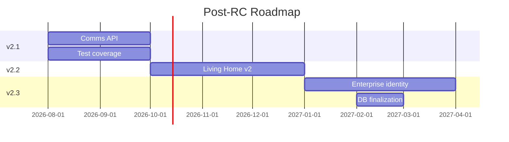

# Future Evolution Roadmap — Post Release Candidate

**Date:** July 11, 2026  
**Baseline:** Owanbe 2.0 RC Certified  
**Horizon:** 12 months

---

## Vision

Owanbe 2.0 establishes the **Operating System for Celebrations** — one identity, multiple workspaces, intelligent home. Post-RC evolution focuses on **real-time intelligence**, **enterprise scale**, and **permanent legacy cleanup**.

---

## v2.1 — Stabilization (0–3 months post-launch)

### Communications Platform
- Unified messages API (organizer ↔ vendor ↔ attendee)
- Push notifications service
- Replace Living Home derived previews with real data

### Quality & Observability
- Living Home widget/integration tests
- Physical device CI smoke suite
- 410 endpoint traffic monitoring dashboard
- Supabase rate-limit production alerting

### Naming Cleanup
- `PortalAccessGuard` → `WorkspaceAccessGuard`
- Consolidate `PortalRoutes` into `ExperienceRoutes`

---

## v2.2 — Intelligence (3–6 months)

### Living Home v2
- Saved events backend
- AI recommendations endpoint (vendor/event matching)
- Real-time activity feed (WebSocket or SSE)
- Personalized quick actions from behavior

### Workspace Enhancements
- Cross-workspace notifications
- Workspace-specific themes
- Tablet-optimized Living Home layouts

---

## v2.3 — Enterprise (6–9 months)

### Identity & Compliance
- Granular KYC/verification status per workspace
- SSO/SAML for enterprise organizers
- Audit log export for `signup_portal_deprecated` reads

### Database Finalization
- Drop `signup_portal_deprecated` (after zero 410 traffic)
- Remove `signupPortal` from API (version bump)
- Stop JWT portal metadata sync

### Admin Evolution
- Workspace governance console
- Multi-tenant workspace analytics

---

## v3.0 — Platform Scale (9–12 months)

### Architecture
- Event-driven workspace state (outbox pattern)
- Edge-cached public listings
- Offline-first Living Home (local snapshot)

### Ecosystem
- Public workspace marketplace (vendor discovery API v2)
- Third-party integrations hub (webhooks per workspace)
- White-label workspace branding

---

## Deprecation Timeline

| Asset | Target Removal | Prerequisite |
|-------|----------------|--------------|
| `POST /auth/complete-signup` (410 stub) | v2.3 | Zero client calls 90 days |
| `signup_portal_deprecated` column | v2.3 | Audit export complete |
| `portal.util.ts` legacy exports | v2.2 | JWT sync stopped |
| `PortalRoutes` compat redirects | v2.2 | Deep links updated |
| `AuthSignupService` portal methods | v2.2 | Internal code audit |

---

## Investment Priorities

---

## Guiding Principles

1. **Never reintroduce portal lock** — workspace access guards only
2. **Hub-first always** — Living Home remains default landing
3. **Incremental activation** — no forced workspace on signup
4. **Evidence-driven deprecation** — monitor before delete
5. **EOS design system** — all new surfaces use existing primitives

---

## Success Metrics (Post-Launch)

| Metric | Target (90 days) |
|--------|------------------|
| Multi-workspace activation rate | > 30% of active users |
| Workspace switch without re-auth | > 95% success |
| Living Home daily return rate | > 60% of DAU |
| 410 legacy endpoint calls | < 0.1% of auth traffic |
| P0 production incidents (identity) | 0 |

---

**This roadmap is advisory. Implementation requires explicit approval per sprint.**
