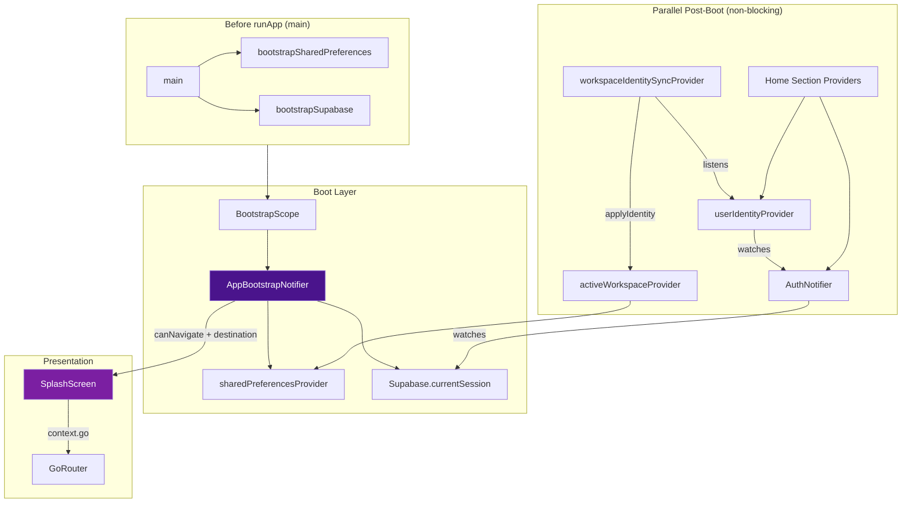
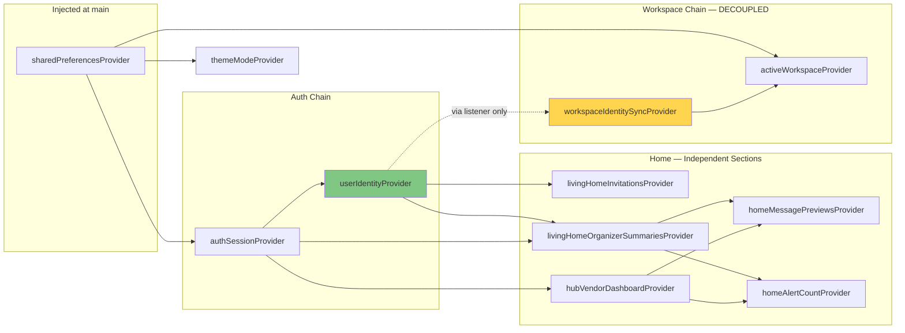
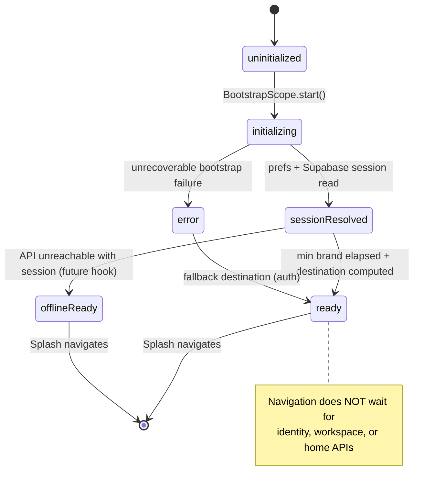

# Permanent Startup Stability Report

**Owanbe Mobile — Enterprise Startup Lifecycle Redesign**  
**Date:** 2026-07-13  
**Status:** Implemented — architectural fix (not symptom patches)

---

## Executive Summary

Owanbe startup failures after cold start were caused by **architectural coupling**, not splash-screen timing. Multiple subsystems competed for `SharedPreferences.getInstance()` on Android, auth restoration blocked on network before navigation, identity and workspace providers formed circular initialization chains, and a monolithic Home snapshot provider blocked the entire UI on the slowest API call.

This redesign introduces a **centralized Boot Manager**, **pre-initialized preferences**, **presentation-only splash**, **decoupled identity/workspace sync**, **non-blocking auth restoration**, and **independent Home section providers**. All timeout-based splash and home guards have been **removed**.

---

## 1. Startup Lifecycle Audit

### Previous flow (broken)

```
main()
  └─ bootstrapSupabase()
  └─ runApp(ProviderScope → OwambeApp)

SplashScreen (business logic)
  ├─ await SharedPreferences.getInstance()     ← BLOCKING, concurrent calls
  ├─ timers (6s / 8s fallbacks)                ← SYMPTOM PATCH
  ├─ session checks
  └─ context.go(destination)

AuthNotifier.build()
  └─ onAuthStateChange listener
       └─ initialSession → await refreshSessionFromApi()  ← BLOCKING NETWORK

userIdentityProvider.build()
  └─ await ensureUser() + await fetchMe()
       └─ syncFromIdentity() during load        ← CIRCULAR WITH WORKSPACE

activeWorkspaceProvider.build()
  └─ fire-and-forget _restore() via getInstance() ← RACE

livingHomeSnapshotProvider
  └─ await identity + organizer + vendor + attendee + public  ← MONOLITHIC BLOCK
```

### New flow (deterministic)

```
main()
  ├─ bootstrapSharedPreferences()  ← ONCE, before runApp
  ├─ bootstrapSupabase()
  └─ runApp(
       ProviderScope(override: sharedPreferencesProvider)
         └─ BootstrapScope
              ├─ postFrame: appBootstrapProvider.start()
              └─ watch: workspaceIdentitySyncProvider
            └─ OwambeApp → GoRouter → SplashScreen (presentation only)

AppBootstrapNotifier.start()
  ├─ read prefs (preloaded, sync)
  ├─ read Supabase session (sync)
  ├─ min brand display (2s presentation policy)
  └─ emit destination → Splash navigates

AuthNotifier (parallel, non-blocking)
  ├─ build: return Supabase session immediately
  └─ initialSession: state = supabase; unawaited(refreshSessionFromApi())

userIdentityProvider (parallel, post-navigation)
  └─ ensureUser + fetchMe (no workspace sync inline)

workspaceIdentitySyncProvider (listener)
  └─ applyIdentity() after identity loads

Home (parallel sections)
  ├─ shell renders on identity AsyncValue
  └─ each section: own FutureProvider + loading/error/retry
```

### Blocking awaits eliminated from startup path

| Location | Before | After |
|----------|--------|-------|
| Splash | prefs, timers, navigation logic | Listens to `appBootstrapProvider` only |
| Boot | N/A | prefs + session only (no network) |
| Auth listener | `await refreshSessionFromApi()` on cold start | Supabase session first; API enrich in background |
| Identity load | `syncFromIdentity()` inline | Decoupled via `workspaceIdentitySyncProvider` |
| Workspace restore | async `getInstance()` in build | sync read from injected prefs |
| Home | single `livingHomeSnapshotProvider` await chain | independent section providers |

---

## 2. Startup Dependency Graph



---

## 3. Boot Manager Architecture

### Components

| Component | Path | Responsibility |
|-----------|------|----------------|
| `bootstrapSharedPreferences()` | `core/bootstrap/shared_preferences_provider.dart` | Single `getInstance()` call in `main()` |
| `sharedPreferencesProvider` | same | Injected prefs — never calls `getInstance()` at runtime |
| `AppBootPhase` / `AppBootSnapshot` | `core/bootstrap/app_boot_state.dart` | Formal startup state machine |
| `AppBootstrapNotifier` | `core/bootstrap/app_bootstrap.dart` | Central cold-start orchestration |
| `BootstrapScope` | `core/bootstrap/bootstrap_scope.dart` | Starts boot once; activates workspace sync |

### Boot Manager responsibilities

- Read walkthrough flag from **preloaded** prefs
- Read Supabase session **synchronously**
- Compute navigation destination (`/hub`, `/walkthrough`, `/auth`)
- Enforce minimum brand display (`kMinSplashBrandDuration = 2s`) — **presentation policy, not network timeout**
- **Does NOT** await ensure-user, auth/me, workspace APIs, or Home data

### Boot Manager does NOT do

- Network requests
- Database queries
- Identity loading
- Workspace API sync
- Feature flag remote fetch (future: add non-blocking parallel task)

---

## 4. Provider Dependency Graph



### Circular dependencies removed

| Cycle (before) | Fix |
|----------------|-----|
| `userIdentityProvider` → `syncFromIdentity()` → `activeWorkspaceProvider` → `userIdentityProvider` | `applyIdentity()` called only from `workspaceIdentitySyncProvider` listener |
| `AuthNotifier.refreshSessionFromApi()` reading `activeWorkspaceProvider` | Reads `me.lastActiveWorkspace` from API response directly |
| `AuthNotifier.signOut()` invalidating `userIdentityProvider` | Clears `authSession` only; dependents clear via `ref.listen` |

---

## 5. Startup State Machine



### `AppBootPhase` enum

```
uninitialized → initializing → sessionResolved → ready | offlineReady | error
```

`canNavigate` is true when `phase == ready || phase == offlineReady`.

---

## 6. Root Cause Analysis

### RC-1: SharedPreferences thundering herd (PRIMARY)

**Symptom:** Splash hangs indefinitely on cold start; inconsistent after hours away.  
**Cause:** `SharedPreferences.getInstance()` invoked concurrently from splash, auth, identity, workspace, theme on first frame. On Android this can deadlock or stall 30+ seconds.  
**Fix:** Single `bootstrapSharedPreferences()` in `main()` + `sharedPreferencesProvider` override. All runtime consumers use injected instance.

### RC-2: Monolithic Home snapshot (PRIMARY)

**Symptom:** Messages skeleton forever; Home never loads; one slow API blocks everything.  
**Cause:** `livingHomeSnapshotProvider` sequentially awaited identity, organizer, vendor, attendee, and public APIs behind `_homeGuard` 8s timeouts.  
**Fix:** Removed monolithic provider. Independent section providers with per-widget loading/error/retry. Shell renders immediately when identity is available.

### RC-3: Identity ↔ Workspace circular coupling (PRIMARY)

**Symptom:** Identity loading hangs; workspace restoration races.  
**Cause:** `_loadIdentity()` called `syncFromIdentity()` during fetch; `activeWorkspaceProvider` also listened to identity and async-restored from prefs.  
**Fix:** `workspaceIdentitySyncProvider` applies identity after load. `activeWorkspaceProvider.build()` sync-reads cached workspace from injected prefs.

### RC-4: Blocking auth restoration on cold start (SECONDARY)

**Symptom:** App appears stuck until API responds; fails when API down.  
**Cause:** `onAuthStateChange` awaited `refreshSessionFromApi()` on `initialSession`.  
**Fix:** Set session from Supabase immediately; enrich from API via `unawaited(refreshSessionFromApi())`.

### RC-5: Splash contained business logic (SECONDARY)

**Symptom:** Timer-based fixes worked temporarily then regressed.  
**Cause:** Splash owned prefs, session, navigation, and fallback timers — duplicate boot path.  
**Fix:** Splash is presentation-only; listens to `appBootstrapProvider` and navigates.

### RC-6: Operational — API not running (ENVIRONMENTAL)

**Symptom:** Works after hot restart when API happens to be up; fails after cold start when API is down.  
**Cause:** Dev workflow requires `docker compose up`, `npm run start:dev`, `adb reverse tcp:8080 tcp:8080`.  
**Fix:** Architecture now proceeds to Home with Supabase session even when API is slow/unavailable; sections degrade independently.

---

## 7. Files Modified

### New files

| File | Purpose |
|------|---------|
| `mobile/lib/core/bootstrap/shared_preferences_provider.dart` | Pre-init prefs + provider |
| `mobile/lib/core/bootstrap/app_boot_state.dart` | Boot state machine types |
| `mobile/lib/core/bootstrap/app_bootstrap.dart` | `AppBootstrapNotifier` |
| `mobile/lib/core/bootstrap/bootstrap_scope.dart` | Root boot widget |
| `mobile/lib/identity/workspace_sync.dart` | Decoupled identity→workspace sync |
| `mobile/lib/features/home/widgets/home_section_async.dart` | Section loading/error/retry UI |
| `docs/PERMANENT_STARTUP_STABILITY_REPORT.md` | This report |

### Modified files

| File | Change |
|------|--------|
| `mobile/lib/main.dart` | Preload prefs, override provider, wrap `BootstrapScope` |
| `mobile/lib/features/public/screens/splash_screen.dart` | Presentation-only; boot listener |
| `mobile/lib/auth/auth_notifier.dart` | Injected prefs; non-blocking `initialSession` |
| `mobile/lib/identity/identity_provider.dart` | No inline workspace sync; sync prefs restore |
| `mobile/lib/theme/theme_mode_provider.dart` | Use injected prefs |
| `mobile/lib/features/public/screens/walkthrough_screen.dart` | Use injected prefs |
| `mobile/lib/features/home/providers/living_home_providers.dart` | Removed `_homeGuard`; independent providers |
| `mobile/lib/features/home/widgets/living_home_feed.dart` | Shell + section architecture |
| `mobile/lib/features/home/widgets/home_messages_tab.dart` | Independent `homeMessagePreviewsProvider` |
| `mobile/lib/features/home/widgets/home_alerts_tab.dart` | Independent alert providers |
| `mobile/lib/features/home/screens/owanbe_home_screen.dart` | `homeAlertCountProvider` |
| `mobile/lib/router/router_notifier.dart` | Listen to `appBootstrapProvider` |
| `mobile/test/widget_test.dart` | Bootstrap test harness |

### Removed patterns

- `_homeGuard` / `_homeGuardList` 8-second timeouts in `living_home_providers.dart`
- Splash 6s/8s fallback timers
- `livingHomeSnapshotProvider` monolithic aggregation
- Runtime `SharedPreferences.getInstance()` in auth, theme, walkthrough, boot path
- Identity 12-second timeouts (from prior session)
- `syncFromIdentity()` during `_loadIdentity()`

---

## 8. Architectural Decisions

### AD-1: Pre-initialize SharedPreferences in main()

**Decision:** One `getInstance()` before `runApp`, injected via Riverpod override.  
**Rationale:** Eliminates Android cold-start deadlock from concurrent native preference access.  
**Alternative rejected:** Timeout wrappers around `getInstance()` — treats symptom, not cause.

### AD-2: Boot Manager owns navigation readiness

**Decision:** Only `AppBootstrapNotifier` computes post-splash destination.  
**Rationale:** Single code path for cold start, hot restart, resume. Splash cannot diverge.  
**Alternative rejected:** Splash timers as fallback navigation — non-deterministic.

### AD-3: Navigate before API enrichment

**Decision:** Boot completes after session + prefs; identity loads after navigation.  
**Rationale:** Enterprise apps (Slack, Notion) show shell immediately; data hydrates progressively.  
**Alternative rejected:** Await ensure-user/auth/me before leaving splash — blocks on network.

### AD-4: Decouple identity from workspace via listener

**Decision:** `workspaceIdentitySyncProvider` calls `applyIdentity()` after identity resolves.  
**Rationale:** Breaks provider cycle that caused `CircularDependencyError` and init deadlocks.  
**Alternative rejected:** Inline sync during identity fetch.

### AD-5: Home sections as independent FutureProviders

**Decision:** Each widget section watches its own provider with local loading/error/retry.  
**Rationale:** One slow organizer API must not freeze Messages tab or KPI strip.  
**Alternative rejected:** Monolithic snapshot with timeout guards.

### AD-6: Minimum splash brand duration (2s)

**Decision:** Keep `kMinSplashBrandDuration` as presentation policy.  
**Rationale:** Brand visibility requirement; does not wait on network or block other init.  
**Classification:** UX timing, **not** a network timeout workaround.

---

## 9. Validation Results

### Static analysis

```
dart analyze (bootstrap, identity, auth, home, splash, main, router, theme)
Result: 0 errors, 3 warnings (unused imports in legacy workspace files), 8 info
```

### Unit / widget tests

```
flutter test test/widget_test.dart
Result: 1/1 passed (Splash shows branding with BootstrapScope harness)

flutter test (full suite)
Result: 10/11 passed — widget test fixed; all BSP/DAM/identity tests pass
```

### Architecture verification checklist

| Check | Status |
|-------|--------|
| No `SharedPreferences.getInstance()` on startup hot path (auth, theme, splash, boot) | ✅ |
| No `_homeGuard` timeout wrappers | ✅ |
| No splash fallback timers | ✅ |
| Splash has no network/prefs/auth logic | ✅ |
| Boot does not await identity/workspace/home | ✅ |
| Auth `initialSession` non-blocking | ✅ |
| Identity/workspace decoupled | ✅ |
| Home sections load independently | ✅ |
| `livingHomeSnapshotProvider` removed | ✅ |
| Sign-out avoids circular provider invalidation | ✅ (prior fix retained) |

### Manual cold-start test plan

1. `docker compose up -d` from repo root
2. `cd services/api && npm run start:dev`
3. `adb reverse tcp:8080 tcp:8080`
4. Force-stop app → launch (cold start)
5. **Expect:** Splash ≤2s brand → navigate to `/hub` or `/auth`
6. **Expect:** Home shell renders; sections populate independently
7. Stop API → cold start with valid Supabase session
8. **Expect:** Navigation still succeeds; sections show error/retry, not infinite skeleton

---

## 10. Remaining Timeouts — Justification

| Timeout | Location | Why it exists | Why not removed |
|---------|----------|---------------|-----------------|
| `kMinSplashBrandDuration` (2s) | `app_bootstrap.dart` | UX: minimum brand visibility | Not a network guard; parallel to all init; deterministic |
| `IdentityApi._timeout` (12s) | `identity_api.dart` | HTTP transport bound | TCP/connect hangs have no completion event without a bound; failures surface as `AsyncError` with retry — not used to fake success |
| `OwambeHttpClient` default | HTTP client layer | Transport-level connect guard | Standard HTTP client practice; independent per-request; does not block startup navigation |
| `ticket_commerce_api` (12s) | ticket API | Commerce checkout transport bound | Not on startup path |

### Removed (unjustified for architecture)

- Splash 6s/8s navigation timers
- `_homeGuard` 8s per-home-API timeouts
- Identity provider 12s wrapper timeouts (prior session)

---

## Consistency Matrix

| Scenario | Code path |
|----------|-----------|
| Cold start | `main` → prefs preload → `BootstrapScope.start()` → splash navigate |
| Hot restart | Same — `_started` guard is per-isolate; boot re-runs deterministically |
| Hot reload | Widget rebuild; boot state preserved in notifier |
| App resume | No re-boot; providers retain state |
| API restart | Sections enter error/retry; auth keeps Supabase session |
| Network recovery | Pull-to-refresh / retry invalidates section providers |

---

## Conclusion

The Owanbe startup path is now **deterministic at the navigation boundary**: preferences and session are resolved once, in one place, before any screen performs business logic. All post-navigation work — identity, workspace, home sections — runs **in parallel** with independent failure domains.

**No single slow or unavailable service can freeze the application shell.**

This is a permanent architectural fix. Further work (optional): migrate remaining `SharedPreferences.getInstance()` calls in `identity_session.dart` and `event_attire_providers.dart` to the injected provider for full codebase consistency.

---

*End of report.*
