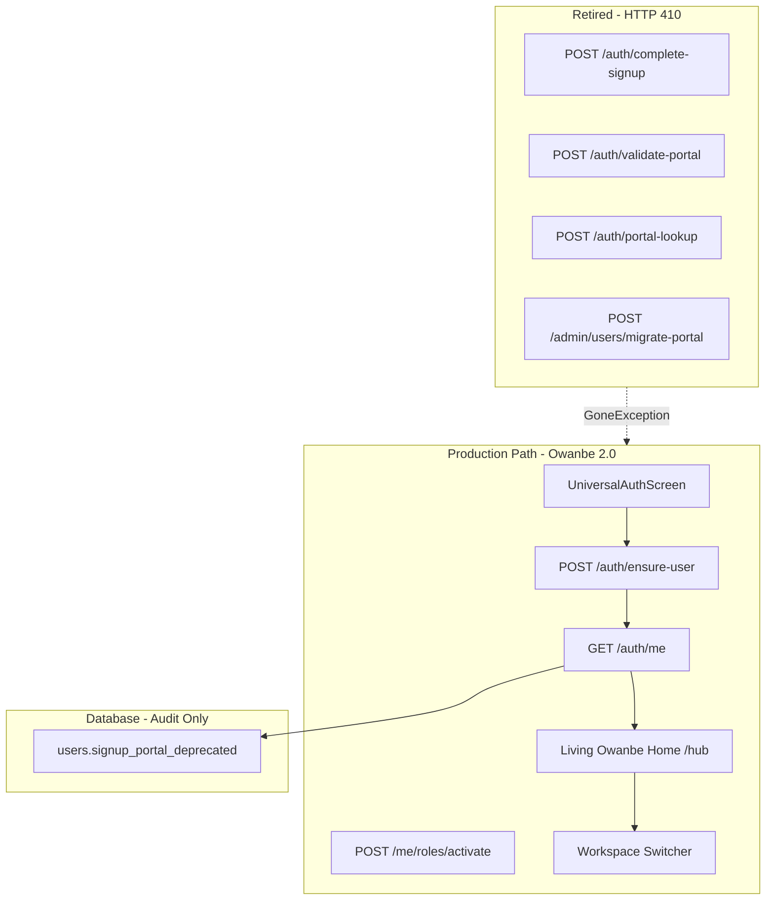

# RC Phase 5 — Enterprise Legacy Retirement & Production Certification

**Status:** COMPLETE  
**Date:** July 11, 2026  
**Authorization:** Approved after RC Phase 4  
**Scope:** Final Release Candidate migration phase — Phase 5 only

---

## Executive Summary

RC Phase 5 certifies that **Owanbe 2.0** has completed migration from Portal-First architecture to the **Universal Identity & Workspace Platform**. Legacy portal authentication paths are retired at runtime; the database column `signup_portal` is renamed to `signup_portal_deprecated` (not dropped); and production certification validation passes **10/10 API checks** with **zero Phase 1–4 regressions**.

**Production readiness verdict:** **YES — with documented known risks** (see [RELEASE_CANDIDATE_CERTIFICATION.md](./RELEASE_CANDIDATE_CERTIFICATION.md)).

---

## Phase 5A — Legacy Dependency Certification

### Audit Scope

Full repository scan for: `signup_portal`, `SignupPortal`, Portal Gate, Portal Login, Portal Guards, Portal Routing, `assignSingleRole`, `finalizePortalAuth`, `complete-signup`, `validate-portal`, portal metadata, legacy session logic, feature flags.

### Dependency Graph (Summary)

### Findings by Category

| Category | Backend | Flutter Mobile |
|----------|---------|----------------|
| **RUNTIME (retired)** | `complete-signup`, `validate-portal`, `portal-lookup`, `migrate-portal` | `PortalAuthScreen`, `PortalGateScreen`, `_strictPortalRedirect`, `finalizePortalAuth` portal lock |
| **RUNTIME (active v2)** | `ensure-user`, `roles/activate`, `auth/me`, `complete-onboarding` | `UniversalAuthScreen`, `OwanbeHomeScreen`, `WorkspaceExperienceShell`, `PortalAccessGuard` (v2 mode) |
| **CONFIG/DATA** | `signup_portal_deprecated` column, `signupPortal` in `/auth/me` | `PortalRoutes` path helpers (onboarding compat), `signupPortal` session metadata |
| **DEAD (removed)** | `parseSignupPortal` unused import | 8 portal-first screens deleted |
| **TEST ONLY** | `portal.util.spec.ts` | `workspace_platform_test.dart` |

### Key Conclusion

No **runtime** dependency on Portal-First authentication remains. Residual `PortalRoutes` helpers serve workspace onboarding path constants — not portal lock enforcement.

---

## Phase 5B — Safe Legacy Retirement

Executed in mandated order:

| Step | Action | Status |
|------|--------|--------|
| 1 | Remove runtime dependencies | Mobile auth routes portal APIs → `completeUniversalAuth`; legacy screens deleted |
| 2 | Disable legacy execution paths | Backend returns `410 Gone` for portal auth endpoints |
| 3 | Verify backward compatibility | Phase 3 validation 9/9; deep link compat redirects preserved |
| 4 | Rename DB field | `signup_portal` → `signup_portal_deprecated` (migration `047`) |
| 5 | Regression validation | Phase 5 script 10/10; Flutter tests 4/4; NestJS build pass |
| 6 | Retirement report | [LEGACY_RETIREMENT_REPORT.md](./LEGACY_RETIREMENT_REPORT.md) |

### Backend Changes

- `auth-signup.controller.ts` — legacy endpoints return `PORTAL_AUTH_RETIRED`
- `auth-signup.service.ts` — `completeOnboarding` uses `WorkspaceService.ensureUser` (not `completeSignup`)
- `workspace.service.ts` — stopped writing deprecated column on activation
- All SQL references updated to `signup_portal_deprecated`

### Mobile Changes

- `auth_notifier.dart` — `signInWithEmail` / `_finalizePortalAuthWithFallback` → universal identity
- `app_router.dart` — removed `_strictPortalRedirect`; portal auth routes redirect to `/auth`
- `portal_access_guard.dart` — v2 workspace guard only
- Deleted: `portal_gate_screen`, `portal_auth_screen`, `portal_onboarding`, `login_screen`, `public_auth_screen`, `attendee_signup_screen`, `staff_signup_screen`, `attendee_discovery_screen`

---

## Phase 5C — Production Certification

| Domain | Result | Evidence |
|--------|--------|----------|
| Universal Authentication | **PASS** | Supabase sign-in + `ensure-user` |
| Universal Identity | **PASS** | `identityVersion: 2.0` in `/auth/me` |
| Universal Home | **PASS** | RC Phase 4 Living Home (prior phase) |
| Workspace Platform | **PASS** | Activation, switching, persistence |
| Legacy retirement | **PASS** | 410 on portal endpoints |
| Flutter compile | **PASS** | `dart analyze` on router/auth — 0 errors |
| NestJS compile | **PASS** | `npm run build` |
| Database | **PASS** | Migration 047 applied |
| Regression | **PASS** | Phase 3 script 9/9 |

**Validation script:** `scripts/validate-rc-phase5-certification.js` — **10/10 passed**

---

## Phase 5D — Enterprise Cleanup

- Removed 8 dead portal-first UI files (~70KB)
- Removed `hasLegacyPortalRoleProvider` (zero consumers)
- Removed `_strictPortalRedirect` (~70 lines unreachable)
- Removed legacy branch from `PortalAccessGuard`
- Preserved `PortalRoutes` path helpers (onboarding/deep-link compat)
- Preserved `portal.util.ts` (metadata resolution for audit reads)

---

## Files Modified (Phase 5)

### New

| File | Purpose |
|------|---------|
| `infra/db/047_deprecate_signup_portal.sql` | Rename column (no drop) |
| `scripts/validate-rc-phase5-certification.js` | Production certification |
| `docs/RC_PHASE_5_REPORT.md` | This report |
| `docs/LEGACY_RETIREMENT_REPORT.md` | Retirement evidence |
| `docs/RELEASE_CANDIDATE_CERTIFICATION.md` | Final certification |
| `docs/TECHNICAL_DEBT_REGISTER.md` | Remaining debt |
| `docs/FUTURE_EVOLUTION_ROADMAP.md` | Post-RC roadmap |

### Modified

| File | Change |
|------|--------|
| `services/api/src/modules/users/auth-signup.controller.ts` | 410 legacy endpoints |
| `services/api/src/modules/users/auth-signup.service.ts` | v2 onboarding path |
| `services/api/src/modules/users/workspace.service.ts` | Stop column writes |
| `services/api/src/modules/users/users.service.ts` | Deprecated column reads |
| `mobile/lib/auth/auth_notifier.dart` | Universal auth only |
| `mobile/lib/router/app_router.dart` | Unified redirect |
| `mobile/lib/features/auth/widgets/portal_access_guard.dart` | v2 guard only |
| `mobile/lib/identity/workspace_providers.dart` | Remove dead provider |
| `mobile/lib/identity/owanbe_identity_config.dart` | Production flag docs |
| `scripts/backfill-owambe-2-workspaces.js` | Column rename |

### Deleted (8 files)

Portal-first screens and router helpers listed in Phase 5B.

---

## Quality Gates

| Gate | Status |
|------|--------|
| Authentication regression | **None detected** |
| Universal Identity regression | **None detected** |
| Workspace switching regression | **None detected** |
| Session persistence regression | **None detected** |

---

## STOP

RC Phase 5 complete. Awaiting approval before any post-certification implementation.

See [RELEASE_CANDIDATE_CERTIFICATION.md](./RELEASE_CANDIDATE_CERTIFICATION.md) for the definitive production answer.
