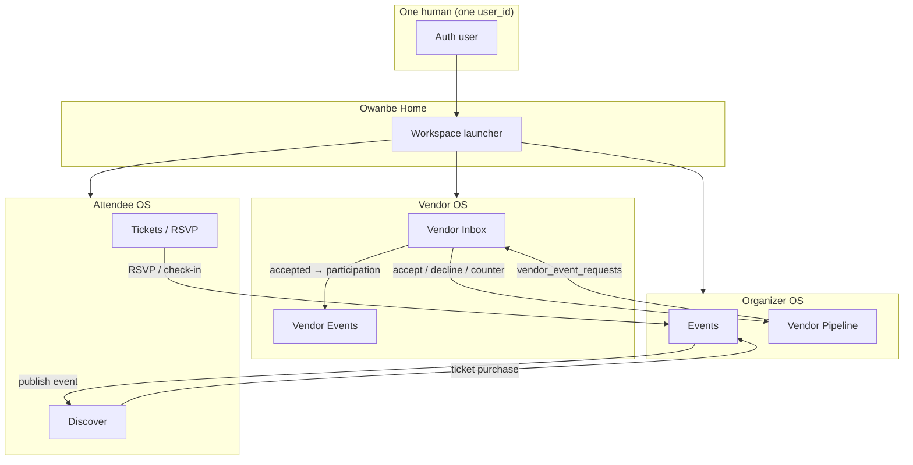

# Unified Identity — Product Architecture

**Sprint type:** Design and architecture review only  
**Status:** North star document — **no implementation in this sprint**  
**Audience:** Product, engineering, QA, and future identity sprints

---

## Executive summary

Owanbe is **one platform for one person**. A single human signs in once, holds one profile, and may **activate** any number of **workspaces** (Organizer, Vendor, Attendee). Each workspace is a fully independent operating system — separate UI, permissions, and business logic — but they are **not** separate accounts.

The dev accounts `attendee@owanbe.dev`, `organizer@owanbe.dev`, and `vendor@owanbe.dev` were **integration shortcuts**. They are **not** the production identity model.

**Logout ends the Owanbe session.** It does **not** switch workspaces. Workspace changes always return through **Owanbe Home (Hub)**.

---

## 1. Current identity model

### 1.1 Production direction (partially built — Identity v2)

The mobile and API layers already contain the skeleton of the target model:

| Concept | Current implementation |
|---------|------------------------|
| Universal auth | Supabase email/password; `WorkspaceService.ensureUser()` creates one `users` row per auth subject |
| Identity envelope | `OwanbeUserIdentity` — one `userId`, many `WorkspaceState` entries |
| Workspace enum | `ExperienceWorkspace`: attendee, organizer, vendor |
| Activation states | `notActivated` → `inProgress` → `active` (plus `suspended`) |
| First-time workspace entry | `POST` workspace activation → creates role + profile stub (`activateWorkspace`) |
| Post-login landing | `WorkspaceLifecycle.postLoginDestination()` → **always `/hub`** |
| Hub | `OwanbeHomeScreen` — workspace launcher, activity, profile |
| Return without logout | `ExperienceNavigation.returnToHub()` / `← Owanbe Home` enterprise back policy |
| Active workspace context | `activeWorkspaceProvider`, `last_active_workspace` on user row |

Relevant code paths (reference only):

- `mobile/lib/identity/user_identity.dart`
- `mobile/lib/identity/workspace_models.dart`
- `mobile/lib/identity/workspace_lifecycle.dart`
- `mobile/lib/identity/experience_navigation.dart`
- `services/api/src/modules/users/workspace.service.ts`
- `mobile/lib/features/activation/screens/workspace_activation_screen.dart`

### 1.2 Legacy and transitional behavior (still present)

Not all runtime paths fully reflect the product model:

| Area | Current behavior | Gap vs target |
|------|------------------|---------------|
| **Dev seeds** | Three distinct Postgres + Supabase users with fixed emails | Implies three people, not one traveler |
| **Portal signup** | `complete-signup`, `signupPortal` metadata | Can read as “pick your permanent account type” |
| **Legacy routing** | `OwanbeIdentityConfig.identityV2` gate; `PortalRoutes` per-role auth | Parallel auth entry points when v2 flag off |
| **Session role** | `UserRole` / `authSessionProvider` still used in Vendor/Organizer guards | Workspace context vs global role can diverge |
| **Profile resolution** | `resolveVendorId`, `resolveOrganizerId` per user — correct shape, but tested with isolated dev users | Works per user; multi-workspace on one user under-tested |
| **Onboarding entry** | Some flows still route by `UserRole` at signup | Should route by **chosen workspace at Hub** |

### 1.3 Development accounts (temporary artifacts)

From `infra/db/029_identity_dev_seed.sql` and v1.0.1 identity verification:

| Email | Purpose today | Production equivalent |
|-------|---------------|------------------------|
| `attendee@owanbe.dev` | Test Attendee OS in isolation | Same human, Attendee workspace active |
| `organizer@owanbe.dev` | Test Organizer OS + events | Same human, Organizer workspace active |
| `vendor@owanbe.dev` | Test Vendor OS + CRM inbox | Same human, Vendor workspace active |

These accounts **own** their respective `organizers`, `vendors`, and ticket rows. That ownership model is correct. What is wrong for production is treating them as **three different humans**.

---

## 2. Target identity model

### 2.1 Core principle

```
ONE PERSON
  └── ONE AUTH SUBJECT (Supabase / JWT)
        └── ONE OWANBE USER ROW (users)
              └── ONE HUMAN PROFILE (display name, email, phone, avatar)
                    ├── OrganizerProfile?   (0..1 per user, created on activation)
                    ├── VendorProfile?      (0..1 per user, created on activation)
                    └── AttendeeProfile?    (0..1 per user, created on activation)
```

### 2.2 What is NOT multiplied

- Authentication credentials
- Email / phone verification at platform level
- Owanbe Home identity card
- Notification inbox at hub level (workspace-scoped views filter within it)

### 2.3 What IS multiplied (by design)

- **Workspaces** — independent OS instances
- **Business profiles** — organizer org, vendor business, attendee entitlements
- **Permissions** — derived from active workspace + activated roles
- **UI shells** — Organizer / Vendor / Attendee dashboards remain separate worlds

### 2.4 The Earth / Countries analogy

| Analogy | Owanbe mapping |
|---------|----------------|
| Earth | Owanbe platform + one auth user |
| Country | Workspace (Organizer, Vendor, Attendee) |
| Passport | Login session (JWT) |
| Visa / residency | Workspace activation + profile |
| Embassy rules | Permissions + business contracts per OS |
| Traveler | Same human — never a new passport to visit another country |

---

## 3. Workspace activation lifecycle

### 3.1 States

```
not_activated ──(user chooses workspace at Hub)──► in_progress ──(onboarding complete)──► active
                                                                                              │
                                                                                              ▼
                                                                                        suspended (admin)
```

### 3.2 First entry flow (target UX)

```
Sign up / Sign in (once)
        │
        ▼
   Owanbe Home (/hub)
        │
        ├── User taps "Organizer" (not activated)
        │         │
        │         ▼
        │   Activation screen (no re-auth)
        │         │
        │         ▼
        │   API: activateWorkspace('organizer')
        │         ├── add role
        │         ├── create organizer + organizer_profile rows
        │         └── set last_active_workspace
        │         │
        │         ▼
        │   Organizer onboarding wizard
        │         │
        │         ▼
        │   Organizer OS (/home)
        │
        ├── (later) ← Owanbe Home
        │
        └── User taps "Vendor" (not activated)
                  │
                  ▼
            Same pattern → Vendor OS (/vendor)
```

**Rules:**

- Activation never creates a new auth account.
- Activation is **lazy** — only when the user first enters that workspace.
- A user may have all three workspaces `active` simultaneously.
- `last_active_workspace` is a **convenience hint**, not identity.

### 3.3 Re-entry flow (workspace already active)

```
Owanbe Home → tap workspace card → workspace home route directly
(no activation, no onboarding unless in_progress)
```

---

## 4. Profile lifecycle

### 4.1 Profile types

| Profile | Storage (conceptual) | Created when | Used by |
|---------|----------------------|--------------|---------|
| **Platform user** | `users` | First authenticated API call (`ensureUser`) | Hub, auth, notifications |
| **OrganizerProfile** | `organizers`, `organizer_profiles` | First Organizer activation | Organizer OS, events, vendor pipeline |
| **VendorProfile** | `vendors`, vendor metadata | First Vendor activation | Vendor OS, inbox, marketplace listing |
| **AttendeeProfile** | entitlements, RSVPs, guest links | First Attendee activation / ticket link | Attendee OS, tickets, check-in |

### 4.2 Ownership rule

All business profiles attach to **the same `user_id`**:

```
users.id ──owner──► organizers.owner_user_id
users.id ──owner──► vendors.owner_user_id
users.id ──holder──► ticket_entitlements.holder_user_id
```

Business contracts (vendor requests, tickets, RSVPs) reference **business IDs** (`event_id`, `vendor_id`, `organizer_id`), not “which account logged in.” Authorization resolves: *this JWT user → owns this vendor row → may act on this request.*

### 4.3 Profile independence

- Organizer profile does **not** expose Vendor dashboard data.
- Vendor profile does **not** expose Organizer event internals.
- Profiles may display the same `display_name` — they are facets of one human, not merged UIs.

---

## 5. Authentication lifecycle

### 5.1 Sign up (target)

```
User enters email/password (or OAuth) once
        │
        ▼
Supabase creates auth subject
        │
        ▼
API ensureUser → users row
        │
        ▼
Owanbe Home — NO portal selection that locks identity
```

**Removed concept (target):** “Register as Vendor” vs “Register as Attendee” as separate products.

**Retained concept:** “Activate Vendor workspace” after login.

### 5.2 Sign in (target)

```
Credentials → JWT session
        │
        ▼
GET /me (identity envelope: workspaces[], roles[], lastActiveWorkspace)
        │
        ▼
Always land on Owanbe Home
```

Optional: deep link may suggest a workspace, but Hub remains the authority for switching.

### 5.3 Session scope

| Session carries | Session does NOT carry |
|-----------------|------------------------|
| `userId`, `tenantId` | Permanent “I am only a vendor” |
| JWT roles (union of activated workspaces) | Separate passwords per workspace |
| `last_active_workspace` hint | Cross-workspace merged UI |

### 5.4 Logout (target)

```
Logout ONLY from Owanbe Home (or global profile)
        │
        ▼
Clears Supabase session + local identity cache
        │
        ▼
Auth screen
```

**Never:** logout from Organizer to “become” Vendor.  
**Always:** `← Owanbe Home` → pick another workspace.

---

## 6. Workspace switching lifecycle

### 6.1 Canonical navigation graph

```
                    ┌─────────────┐
                    │ Owanbe Home │
                    │   (/hub)    │
                    └──────┬──────┘
           ┌───────────────┼───────────────┐
           ▼               ▼               ▼
    ┌────────────┐  ┌────────────┐  ┌────────────┐
    │ Attendee OS│  │Organizer OS│  │ Vendor OS  │
    │ /attendee  │  │   /home    │  │  /vendor   │
    └─────┬──────┘  └─────┬──────┘  └─────┬──────┘
          │               │               │
          └───────────────┴───────────────┘
                          │
              ← Owanbe Home (enterprise back)
                          │
                    (stay signed in)
```

### 6.2 Switching steps (target)

1. User in Vendor OS presses `← Owanbe Home` (or Workspace Switcher).
2. Router goes to `/hub` — **session unchanged**.
3. `activeWorkspaceProvider` updates when user opens another workspace.
4. API `last_active_workspace` updated for resume convenience.
5. User opens Organizer OS — same JWT, different shell.

### 6.3 Android / system back

Enterprise navigation policy already treats Hub as the **parent** of workspace routes. Target: system back from any workspace **must** return to Hub, not exit the app (except from Hub → exit).

---

## 7. Business contract diagram

Operating systems communicate through **records and APIs**, not shared dashboards.



### Contract table

| Contract | Producer | Consumer | Record / API |
|----------|----------|----------|--------------|
| Vendor request | Organizer OS | Vendor OS | `vendor_event_requests` |
| Vendor response | Vendor OS | Organizer OS | stage transition / negotiation offers |
| Event publication | Organizer OS | Attendee OS | `events.status = published` |
| Ticket purchase | Attendee OS | Organizer OS | `ticket_orders`, entitlements |
| RSVP | Attendee OS | Organizer OS | guest / invitation records |
| Vendor participation | Vendor OS (accept) | Vendor OS (events) | `vendor_event_participations` |

**Identity rule for contracts:** contracts bind `organizer_id`, `vendor_id`, `event_id`, `user_id` — never “which email account logged in” as a business key.

---

## 8. Migration strategy

**This section is planning only. No execution in this sprint.**

### Phase A — Align product narrative (documentation + UX copy)

- Hub is the front door; workspaces are modes, not accounts.
- Remove user-facing “sign up as vendor” language where it implies a separate product account.
- Document `← Owanbe Home` as the switch mechanism.

### Phase B — Runtime consistency (future sprint)

- Make `activeWorkspaceProvider` the single gate for OS entry guards (reduce raw `UserRole` session checks).
- Ensure all post-auth redirects use Hub when `identityV2` is production-default.
- Deprecate `PortalRoutes.authFor(role)` entry points.
- Retire `signupPortal` as a lock; keep only as analytics metadata if needed.

### Phase C — Data model validation (future sprint)

- Verify one test user can hold organizer + vendor + attendee profiles concurrently.
- Fix any unique constraints that accidentally enforce one-workspace-per-human.
- Audit `resolveVendorId` / `resolveOrganizerId` — must resolve **profiles for this user**, not “the vendor user.”

### Phase D — Dev seed evolution (future sprint)

- Introduce `traveler@owanbe.dev` (or similar) with all three workspaces activatable.
- Keep `attendee@`, `organizer@`, `vendor@` for **automated isolation tests** only.
- Update integration test docs to distinguish **product manual QA** vs **isolated regression**.

### Phase E — Cleanup (future sprint, explicit approval)

- Remove legacy portal auth UI behind feature flag removal.
- Consolidate onboarding routes under workspace activation only.

### Non-goals (explicit)

- ❌ Merge Organizer / Vendor / Attendee dashboards
- ❌ Delete dev accounts without approved migration sprint
- ❌ Change Supabase auth provider in identity sprint
- ❌ Break business contracts established in Vendor OS integration

---

## 9. Developer seed strategy

### 9.1 Short term (current)

Keep three isolated dev users for:

- Parallel CI jobs that must not share state
- Bug reproduction with a single role
- Vendor CRM / Organizer pipeline integration proofs

### 9.2 Medium term (target)

| Seed type | Purpose |
|-----------|---------|
| **Unified traveler account** | Manual QA: Hub → activate all workspaces → walk full journeys |
| **Isolated role accounts** | Automated tests requiring fixed `user_id` / ownership |
| **Admin / superadmin** | Platform ops (unchanged) |

### 9.3 Recommended unified manual QA account (future)

```
email:    traveler@owanbe.dev  (or personal test email)
workspaces: all not_activated on first login → activate each via Hub
owns:     organizer row + vendor row + ticket entitlements after activation flows
```

### 9.4 Testing matrix

| Scenario | Account strategy |
|----------|------------------|
| “Can one person be vendor and organizer?” | Unified traveler only |
| “Vendor inbox API authorization” | Isolated vendor OR traveler in vendor workspace |
| “Attendee unaffected by vendor sprint” | Traveler in attendee workspace |
| “CRM contract end-to-end” | Traveler: organizer workspace → request → vendor workspace → accept |

---

## 10. Why this architecture scales

### 10.1 Product

- **Lower friction** — one signup; users explore roles organically.
- **Real-world fit** — wedding planners also attend events; caterers also organize pop-ups.
- **Clear mental model** — Hub = Earth; workspaces = countries.

### 10.2 Engineering

- **Single auth pipeline** — fewer Supabase users, simpler support.
- **Additive profiles** — new workspace types (e.g. Sponsor OS) = new activation + profile, not new auth system.
- **Contract isolation** — OS teams ship independently; identity layer stays thin.
- **Authorization clarity** — JWT proves human; workspace + profile proves permission.

### 10.3 Operations

- **Support** — one email to find all activity across workspaces.
- **Compliance** — one data subject; workspace-scoped export filters.
- **Fraud** — correlate behavior across workspaces without account linking hacks.

### 10.4 What we already proved

Recent Vendor OS integration demonstrated the correct pattern:

- Organizer and Vendor remain **separate UIs**
- They sync through **`vendor_event_requests`** (business contract)
- Canonical `vendor_id` must match the **vendor profile owned by the acting user** — not a marketplace alias or a second account

Unified identity extends that principle from **vendor CRM** to **the entire platform**.

---

## Appendix A — Glossary

| Term | Definition |
|------|------------|
| **Auth user** | Supabase/JWT subject — how you prove who you are |
| **Owanbe user** | Row in `users` — platform identity |
| **Workspace** | One of Attendee, Organizer, Vendor OS instances |
| **Activation** | First-time enablement of a workspace for this user |
| **Profile** | Business persona data for a workspace (org, vendor business, attendee entitlements) |
| **Hub** | Owanbe Home — launcher; only place to switch worlds without logging out |
| **Business contract** | API + DB record connecting two OSes without shared UI |

---

## Appendix B — Decision log (this sprint)

| Decision | Rationale |
|----------|-----------|
| One login, many workspaces | Matches user Earth/countries model |
| No logout to switch | Logout is leaving Owanbe, not changing hat |
| Lazy profile creation | Reduces signup friction |
| Keep three OSes separate | Enterprise modularity; prior Event OS + Vendor OS sprints |
| Dev accounts remain for now | Integration value; not production model |
| No implementation this sprint | North star before code churn |

---

**STOP.**

This document is the **north star for all future identity work**. Implementation sprints must reference this doc and explicitly state which phase (A–E) they execute.

No code, database, authentication, or account changes were made to produce this document.
