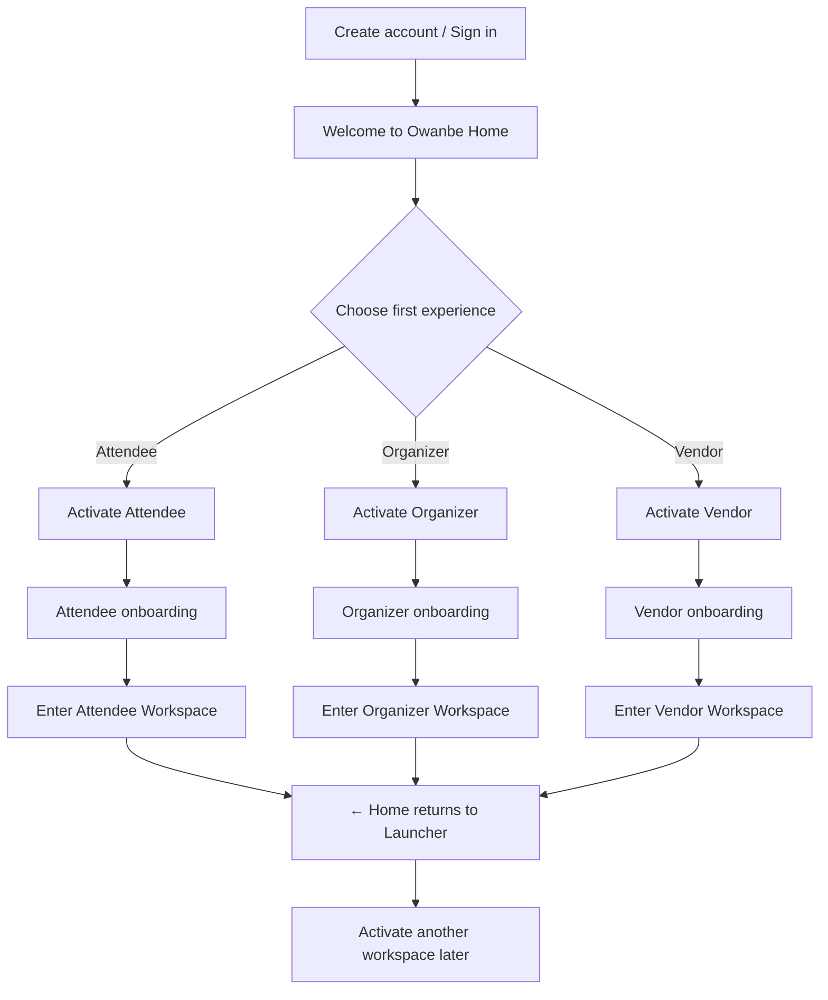

# Workspace Experience UX Redesign Review

**Date:** 2026-07-14  
**Status:** Review only — no implementation  
**Scope:** Universal Identity + Workspace UX (presentation layer)

---

## Executive Summary

The **architecture is correct**. Universal Identity, workspace activation, and workspace shells already support “one account, multiple worlds.” The confusion is a **presentation-layer mismatch**: RC Phase 4 built Living Home as a blended command center, while the product intent is a **Workspace Launcher** that leads into isolated environments.

This is a **UX redesign**, not an auth, boot, or identity rewrite. Most building blocks already exist (`WorkspaceExperienceCard`, `WorkspaceExperienceShell`, `WorkspaceContextActions`, per-workspace routes).

---

## 1. Workspace Experience Review

### What works today (architecture)

| Layer | Status | Evidence |
|-------|--------|----------|
| Universal login | ✅ | Single `AuthNotifier` + `userIdentityProvider` |
| Workspace activation | ✅ | `/activate/*` + `POST /me/roles/activate` |
| Per-workspace homes | ✅ | `/attendee`, `/home` (organizer), `/vendor` |
| Workspace shell | ✅ | `WorkspaceExperienceShell` sets `activeWorkspace` |
| Return to hub | ✅ | `WorkspaceContextActions` → `context.go(/hub)` |
| Workspace switcher | ✅ | Bottom sheet without sign-out |
| Launcher routing | ✅ | `WorkspaceLifecycle.launcherDestination()` |

### What feels wrong today (UX)

| Issue | Root cause in code |
|-------|-------------------|
| “Everything at once” | `LivingHomeFeed` renders `_AttendeeSection`, `_OrganizerSection`, `_VendorSection` when each `canAccess()` |
| KPIs mixed together | `_GlobalKpiStrip` shows Tickets + Revenue + Earnings on one row |
| Workspace choice buried | Premium `WorkspaceExperienceCard` list appears **after** all blended sections |
| Weak “where am I?” on hub | Hub title is always “Owanbe Home” — no active-world framing |
| Messages/Alerts feel global | `homeMessagePreviewsProvider` / `hubOrganizerAlertsProvider` aggregate cross-workspace |
| RC Phase 4 intent vs product intent | Phase 4 = command center; product intent = launcher → world |

### Current vs desired mental model

```
TODAY (blended command center):
  Hub = Attendee UI + Organizer UI + Vendor UI + launcher cards

DESIRED (launcher → world):
  Hub = Welcome + workspace cards + light platform layer
  Organizer world = only organizer UI (inside /home shell)
  Vendor world = only vendor UI (inside /vendor shell)
  Attendee world = only attendee UI (inside /attendee shell)
```

---

## 2. Proposed User Journey

### New user (progressive)



**Copy tone on hub:**

> Welcome back, **Ada**.  
> This is your Owanbe Home.  
> Choose an experience to enter.

### Returning user (one or more workspaces active)

1. Land on **Workspace Launcher** (`/hub`)
2. See three premium cards with clear CTAs:
   - **Not activated** → “Activate Workspace”
   - **In progress** → “Continue Setup”
   - **Active** → “Enter Workspace”
3. Optional: subtle “Last opened: Organizer” on the matching card
4. Tap **Enter** → navigate to that workspace only
5. Inside workspace: persistent context (“Organizer Workspace”) + **← Home**

### Multi-workspace power user

- Hub remains launcher — never shows all dashboards stacked
- **Switch Workspace** (existing switcher) jumps between worlds or returns to hub first
- Cross-workspace **Recent Activity** on hub is summary-only (one line per world), not full dashboards

---

## 3. Navigation Flow

### Route map (unchanged — reuse existing routes)

| Destination | Route | Shell |
|-------------|-------|-------|
| Workspace Launcher | `/hub` | `OwanbeHomeScreen` (redesigned feed) |
| Attendee world | `/attendee` | `WorkspaceExperienceShell(attendee)` |
| Organizer world | `/home` + customer shell | `WorkspaceExperienceShell(organizer)` |
| Vendor world | `/vendor` | `WorkspaceExperienceShell(vendor)` |
| Activation | `/activate/{workspace}` | Standalone flow → onboarding |

### Navigation rules (proposed)

| Action | Behavior |
|--------|----------|
| Post-login | Always `/hub` (launcher) — **keep** `WorkspaceLifecycle.postLoginDestination()` |
| Enter workspace | `ExperienceNavigation.launcherTarget()` → workspace home |
| ← Home | `ExperienceNavigation.returnHome()` → `/hub` |
| Switch workspace from inside world | Option A: go to hub first (clearer). Option B: direct swap (faster). **Recommend A for premium clarity.** |
| Deep links | Workspace routes guarded by `PortalAccessGuard` — unchanged |

### Hub bottom nav (proposed simplification)

| Tab | Purpose |
|-----|---------|
| **Home** | Workspace Launcher (primary) |
| **Activity** | Cross-workspace notifications summary (replaces blended Messages + Alerts) |
| **Profile** | Account, settings, sign out |

Workspace-specific messages/alerts move **inside** each workspace shell.

---

## 4. Home Redesign Proposal

### Workspace Launcher layout (top → bottom)

1. **Welcome header** — avatar, name, “Your Owanbe Home”
2. **Workspace cards (hero)** — three full `WorkspaceExperienceCard` (not compact), primary CTA:
   - Activate Workspace / Continue Setup / Enter Workspace
3. **Continue setup** — only in-progress workspaces (if any)
4. **Recent activity** — aggregated timeline, max 3 items, no KPIs
5. **Platform announcements** — Owanbe OS updates
6. **Quick shortcuts** — Discover events, Help (optional, hub-level only)

### Remove from hub (move to workspace homes)

| Removed from hub | Lives in |
|------------------|----------|
| Attendee invitations, tickets | `/attendee` dashboard |
| Organizer events, revenue KPIs | `/home` organizer hub |
| Vendor bookings, earnings | `/vendor` dashboard |
| `_GlobalKpiStrip` (mixed KPIs) | Per-workspace dashboards |
| Organizer quick actions row | Organizer workspace |
| Trending vendors carousel | Attendee or public discover |
| Full section dashboards | Respective workspace shells |

### Premium card treatment

- Use existing **full** `WorkspaceExperienceCard` (not `compact: true`)
- One card per row, generous spacing, workspace-specific gradient/iconography
- Clear status badge: Not activated / In progress / Active
- Single primary button per card — no duplicate onboarding cards above and cards below

### Inside each workspace (strengthen “world” feel)

Already partially exists — enhance consistently:

- App bar: `WorkspaceContextChip` + “← Home” (rename tooltip from icon-only)
- Subtitle: “Organizer Workspace” / “Vendor Workspace” / “Attendee Workspace”
- Remove hub-style cross-workspace widgets from workspace screens

---

## 5. Existing User Migration Strategy

**No database migration required.** This is a UI/navigation presentation change.

| User state | Hub experience after redesign |
|------------|----------------------------|
| 0 workspaces active | Three cards, all “Activate Workspace” |
| 1 workspace active | One “Enter”, two “Activate” |
| 2–3 workspaces active | Multiple “Enter Workspace” cards — **no blended dashboards** |
| In-progress onboarding | “Continue Setup” on relevant card |

| Concern | Strategy |
|---------|----------|
| `lastActiveWorkspace` | Highlight matching card (“Last opened”) — optional visual only |
| `activeWorkspaceProvider` | Still set when entering a world via shell — unchanged |
| Messages users expect on hub | Collapse to **Activity** tab summary; full detail in workspace |
| RC cert account (all 3 active) | Still valid — hub shows 3 Enter cards, not 3 dashboards |

**Rollout:** Single mobile release; no API changes; no identity schema changes.

---

## 6. Fresh Testing Strategy

### Phase A — After UX redesign (do not test blended hub now)

| Test | Account | Goal |
|------|---------|------|
| New user progressive journey | **New UX test account** | Sign up → pick one workspace → activate → onboard → enter → return home |
| Second activation | Same new account | Return home → activate second workspace |
| Workspace isolation | Same new account | Confirm organizer KPIs only in organizer world |
| Return navigation | Same new account | ← Home from each workspace |
| Switcher | Same new account | Switch between active worlds |

### Phase B — Regression (keep RC cert account)

| Test | Account | Goal |
|------|---------|------|
| API certification journey | `attendee@owambe.dev` (or cert account) | ensure-user, activate, switch, 410 legacy |
| Multi-workspace launcher | Cert account | Three Enter cards, no blended sections |
| Startup stability | Any | Boot → hub → enter world (unchanged) |

### Recommended new UX test account

- **Email:** e.g. `ux.test@owambe.dev` (or any new sign-up)
- **Password:** your choice
- **Do not delete** cert account

---

## 7. Account Strategy Recommendation

| Account | Role | Recommendation |
|---------|------|----------------|
| **RC certification account** (`attendee@owambe.dev` with all 3 workspaces) | API regression, multi-workspace launcher, legacy 410 checks | **Keep** as official certification account |
| **New UX test account** | First-time user journey, progressive activation | **Create** after redesign — no delete needed |

### Why keep the cert account

- RC Phase 5 validation (10/10) exercised this identity state
- Multi-workspace edge cases need a known-good account
- Deleting would lose reproducible certification state

### Why create a new UX account

- Cert account is **pre-activated** on all three workspaces — cannot simulate true first-time flow
- New account tests progressive activation without DB reset
- Zero risk to certification tooling

**Do not delete the RC account unless a future hygiene sprint explicitly requires it.**

---

## Implementation scope (for approval — not executed)

| Change type | Files (indicative) | Risk |
|-------------|-------------------|------|
| Hub feed redesign | `living_home_feed.dart`, `living_home_providers.dart` | Low |
| Hub tabs simplify | `owanbe_home_screen.dart`, `home_messages_tab.dart`, `home_alerts_tab.dart` | Low |
| Workspace chrome polish | `workspace_experience_shell.dart`, vendor/organizer/attendee top bars | Low |
| **No change** | Boot, auth, identity API, `app_router` structure | — |

Estimated effort: **1–2 focused sessions** (presentation only).

---

## Final Question

**Should we redesign the workspace experience before beginning fresh user testing?**

### Answer: **Yes.**

**UX reasoning:** Testing now against the blended command center will produce feedback you have already identified as invalid. Fresh-user testing must validate the **launcher → world** model, not a UI you intend to retire.

**Architectural reasoning:** Per-workspace shells, routes, activation, and `activeWorkspace` already exist. The redesign removes duplicate dashboard rendering from `LivingHomeFeed` and elevates `WorkspaceExperienceCard` to the hero — **no boot, auth, or API changes**. Risk is low; clarity gain is high.

---

*Awaiting approval before implementation.*
