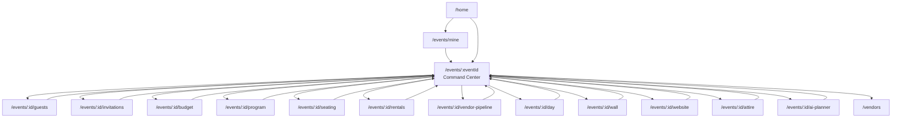

# Phase 42.2 — Customer Portal Canonicalization

**Status:** Complete  
**Scope:** Architecture migration only — no new features, no DB migrations, no API changes.

---

## Objective

Establish the Customer Portal as the **only canonical Event Operating System** for organizers. Eliminate direct Customer → Legacy Organizer dependencies while preserving all functionality through compatibility adapters and redirects.

---

## Customer Portal audit (pre-migration)

### Screen inventory

| Screen | Route | Legacy `/organizer` nav | Organizer imports (pre) | Navigation pattern (pre) |
|--------|-------|-------------------------|-------------------------|--------------------------|
| Home | `/home` | None | `organizer_*` via providers/models | `CustomerRoutes`, hardcoded `/events`, `/attendee` |
| My Events | `/events/mine` | None | via `customer_home_providers` | `CustomerRoutes` |
| Create Event | `/events/create` | None | `EventCreateWizardV2Screen` direct | Shell route |
| Guests hub | `/guests` | None | via providers | `CustomerRoutes` → event guests (bypassed CC) |
| Command Center | `/events/:id` | Fixed in 42.1 | `organizer_*` | `eventNav` (42.1) |
| Guests module | `/events/:id/guests` | None | `organizer_providers` | `CustomerRoutes.eventDetail` back |
| Invitations | `/events/:id/invitations` | None | `organizer_providers` | `CustomerRoutes` |
| Budget | `/events/:id/budget` | None | finance + providers | `CustomerRoutes` |
| Vendor pipeline | `/events/:id/vendor-pipeline` | None | None | `context.pop()` only |
| Marketplace | `/vendors` | Fixed in 42.1 | `organizer_persistence` in sheet | `CustomerRoutes`, `EventRouteRegistry` mix |
| Program | `/events/:id/program` | None | `organizer_providers` | `context.pop()` |
| Seating | `/events/:id/seating` | None | `organizer_providers` | `context.pop()` |
| Event Day | `/events/:id/day` | None | via command providers | `CustomerRoutes` |
| Rentals | `/events/:id/rentals` | None | None | `CustomerRoutes` |
| Aso-Ebi / Attire | `/events/:id/attire` | None | None | `CustomerRoutes` |
| Wall | `/events/:id/wall` | None | None | `CustomerRoutes` |
| Wall display | `/events/:id/wall/display` | None | None | `context.pop()` |
| Website | `/events/:id/website` | None | None | `CustomerRoutes` |
| AI Planner | `/events/:id/ai-planner` | None | `organizer_models/providers` | `CustomerRoutes` |
| Profile | `/profile` | None | None | hardcoded `/events`, `/attendee`, `/` |

**Finding:** No Customer Portal screen navigated to `/organizer/*` after Phase 42.1. Remaining debt was **data-layer imports** from `features/organizer/*` and **hardcoded route strings** via `CustomerRoutes` / literals.

---

## Changes delivered

### 1. Centralized navigation — `EventNavigator` + `EventNavigation`

**File:** `mobile/lib/portals/customer/navigation/event_navigator.dart`

- Instance API: `context.eventNav.openOverview(eventId)`, `backToOverview(eventId)`, etc.
- Static API: `EventNavigation.openProgram(context, eventId)` (Phase 42.2 contract)
- Shell helpers: `goHome`, `goMyEvents`, `openDiscover`, `openAttendeeDashboard`, `goLanding`
- Module helpers: all required methods including `openAsoEbi` → canonical `/events/:id/attire`

**Rule:** No hardcoded route strings remain in `mobile/lib/portals/customer/**` (screens, widgets, shell).

### 2. Compatibility adapter — single Organizer touchpoint

**File:** `mobile/lib/portals/customer/adapters/legacy_organizer_compat.dart`

Customer Portal no longer imports `features/organizer/*` directly. All legacy data access flows through this **temporary compatibility adapter**, which re-exports:

- `organizer_models.dart`
- `organizer_providers.dart`
- `organizer_event_store.dart`
- `organizer_persistence.dart`
- `organizer_finance_api.dart` + `organizer_finance_providers.dart`
- `event_create_wizard_v2_screen.dart`

### 3. Navigation consistency — return to Command Center

Event modules use `context.eventNav.backToOverview(eventId)` on back navigation when the stack cannot pop:

- Guests, Invitations, Budget, Program, Seating, Rentals, Attire, Wall, Website, AI Planner, Event Day, Vendor pipeline

**Workspace flow:**

```
/home → /events/mine → /events/:eventId (Command Center) → /events/:eventId/{module}
```

- My Events and Home open events via `openOverview()` (Command Center first).
- Global Guests hub (`/guests`) now opens `openOverview()` instead of jumping directly to event guests module.

### 4. Legacy Organizer redirects (enhanced)

**File:** `mobile/lib/portals/customer/router/legacy_organizer_router.dart`

- Submodule paths: `/organizer/events/:id/guests` → `/events/:id/guests`, etc.
- Preserves query parameters (excluding consumed `tab` / `tabKey` / `module`)
- `module` query param support for deep links
- `app_router.dart` registers per-module redirect routes under `/organizer/events/:eventId/*`

Redirects are silent (no user-visible flash).

### 5. Route registry updates

**File:** `mobile/lib/portals/customer/router/event_route_registry.dart`

Added public/shell paths: `discover`, `attendeeDashboard`, `landing`, `vendorsWithCategory()`.

### 6. Shell route

`customer_shell_route.dart` now uses `EventRouteRegistry` paths directly (not deprecated `CustomerRoutes`).

---

## Removed dependencies

| Before | After |
|--------|-------|
| 24 files importing `features/organizer/*` | 1 adapter file (`legacy_organizer_compat.dart`) |
| `CustomerRoutes` / hardcoded paths in Customer screens | `EventNavigator` exclusively |
| Direct wizard import in create screen | Adapter re-export |
| `CustomerRoutes` in `customer_shell_route` | `EventRouteRegistry` |
| `CustomerRoutes` in `app_router` redirect guards | `EventRouteRegistry` |

---

## Remaining legacy dependencies (documented)

All are isolated in `legacy_organizer_compat.dart`:

| Dependency | Used for | Migration target (future phase) |
|------------|----------|-------------------------------|
| `OrganizerEvent` / attendee models | Event summaries, guests, invitations, budget | `portals/customer/models/event_core_models.dart` |
| `organizerEventProvider` | Event-scoped screens & providers | `customerEventProvider` |
| `organizerFinanceApiProvider` | Budget & command center finance | Customer finance service |
| `OrganizerEventStore` | Mock fallback / ownership checks | Customer event store |
| `inviteVendor` / persistence | Marketplace vendor requests | Customer vendor request API layer |
| `EventCreateWizardV2Screen` | Create event flow | Customer-native wizard wrapper |

Legacy Organizer Portal code under `features/organizer/**` is **unchanged** and still compiles; it is not mounted by Customer routes.

---

## Navigation graph



---

## Redirect strategy

| Legacy URL | Event OS destination |
|------------|---------------------|
| `/organizer` | `/home` |
| `/organizer/events/new` | `/events/create` |
| `/organizer/events/:id` | `/events/:id` (+ tab/tabKey/module mapping) |
| `/organizer/events/:id/guests` | `/events/:id/guests` |
| `/organizer/events/:id/program` | `/events/:id/program` |
| `/organizer/events/:id/finance` | `/events/:id/budget` |
| … | (full list in `LegacyOrganizerRouter.redirectModule`) |

---

## Screens affected

All files under `mobile/lib/portals/customer/screens/**`, plus:

- `shell/customer_shell.dart`
- `widgets/ai_planner/*` (navigation)
- `router/customer_shell_route.dart`
- `router/legacy_organizer_router.dart`
- `router/event_route_registry.dart`
- `navigation/event_navigator.dart`
- `adapters/legacy_organizer_compat.dart` (new)
- `router/app_router.dart` (legacy submodule redirects)
- `customer_portal.dart` (exports)

---

## Risk assessment

| Risk | Severity | Mitigation |
|------|----------|------------|
| Adapter still couples to Organizer data layer | Medium | Single file boundary; documented migration path |
| Home quick-actions open modules directly (AI planner) | Low | Explicit shortcuts; still Event OS routes |
| `/events/:id/tickets` = public purchase screen | Low | Pre-existing; not introduced in 42.2 |
| Deep links with legacy tab indices | Low | `LegacyOrganizerRouter` tab mapping preserved |
| `CustomerRoutes` deprecated but retained | Low | Used only outside Customer portal (legacy organizer screens) |

---

## Verification

```bash
cd mobile && flutter analyze    # 0 errors (warnings/info only)
cd mobile && dart analyze lib/portals/customer
cd services/api && npm run build
```

**Checklist:**

- ✓ No Customer screen opens Organizer Portal
- ✓ No Customer route leaks into `/organizer`
- ✓ Event navigation centralized via `EventNavigator`
- ✓ Legacy `/organizer/*` redirects preserve eventId, module, and query params
- ✓ No user-visible behavior changes (same screens, same APIs)
- ✓ No database changes
- ✓ No API regressions

---

## Related documents

- [PHASE42_1_PORTAL_FOUNDATION.md](./PHASE42_1_PORTAL_FOUNDATION.md)
- [OWANBE_EVENT_OS_ARCHITECTURE.md](../product_architecture/OWANBE_EVENT_OS_ARCHITECTURE.md)

---

## Out of scope (per phase charter)

- Deleting legacy Organizer Portal code
- UI consolidation of Organizer widgets
- Replacing adapter with native Customer data models
- Organizer Portal deprecation
