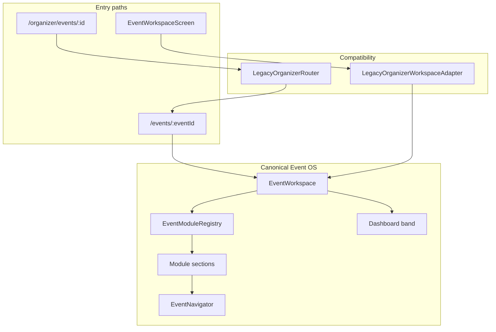

# Phase 42.3 — Event Workspace Unification (Single Command Center)

**Status:** Complete  
**Scope:** Architecture and UX consolidation — no new features, no DB migrations, no API changes.

---

## Objective

Consolidate the Customer Event Command Center and legacy Organizer Command Center V3 into one unified **Event Workspace**. Every organizer manages events through the same shell regardless of entry path.

---

## Before vs after architecture

### Before

```
Customer Portal                          Legacy Organizer Portal
/events/:eventId                         /organizer/events/:id (redirect)
    │                                        │
CustomerEventCommandCenterScreen       EventWorkspaceScreen
(flat card list, manual layout)       (tabbed CC V3 shell)
    │                                        │
    ├─ CommandSummaryGrid                ├─ OverviewTabV3
    ├─ Manual module cards               ├─ TicketsTabV3
    ├─ CelebrationSuiteRow             ├─ AttendeesTabV3 …
    └─ CommandQuickActions               └─ 9 embedded tab UIs
```

Two parallel dashboards with duplicated KPIs (health cards vs summary grid, dual planning rings).

### After

```
                    ┌─────────────────────────────┐
                    │      EventWorkspace         │
                    │  (canonical Event OS shell) │
                    └──────────────┬──────────────┘
                                   │
          ┌────────────────────────┼────────────────────────┐
          │                        │                        │
   /events/:eventId          LegacyOrganizer          LegacyOrganizer
   (owned events)       WorkspaceAdapter          route redirects
          │              (compat wrapper)                │
          └────────────────────────┴────────────────────────┘
```

- **One conceptual workspace** — `EventWorkspace`
- **One module registry** — `EventModuleRegistry`
- **Legacy V3 tabs** — no longer render independently

---

## Feature matrix (audit)


| Capability                  | Customer CC (pre)     | Organizer CC V3 (pre)         | Unified workspace                       |
| --------------------------- | --------------------- | ----------------------------- | --------------------------------------- |
| Countdown hero              | ✅ CelebrationHero     | ✅ CcV3EventHero               | ✅ CelebrationHero                       |
| Planning progress ring      | ✅                     | ✅ (duplicate)                 | ✅ Single ring                           |
| Guest/vendor/budget KPIs    | ✅ CommandSummaryGrid  | ✅ CcV3HealthCards (duplicate) | ✅ CommandSummaryGrid only               |
| Planning reminders          | ❌                     | ✅ CcV3RemindersPanel          | ✅ Via reminders bridge                  |
| Publish / Go live           | ❌                     | ✅ Overview actions            | ✅ Lifecycle action row                  |
| Activity timeline           | ✅ CommandActivityFeed | ✅ CcV3Timeline                | ✅ CommandActivityFeed                   |
| Quick actions               | ✅ Hardcoded           | ✅ Tab navigation              | ✅ Registry-driven chips                 |
| Module navigation           | ❌ Manual cards        | ✅ Tab chips                   | ✅ Registry categories                   |
| Tickets module              | ✅ Summary tap         | ✅ TicketsTabV3                | ✅ Registry → ticket route               |
| Guests                      | ✅ Module screen       | ✅ AttendeesTabV3 (dup UI)     | ✅ Customer guests screen                |
| Invitations                 | ✅ Module screen       | ✅ Button in overview          | ✅ Registry                              |
| Budget / Finance            | ✅ Budget screen       | ✅ FinanceTabV3 (dup)          | ✅ Budget route (both labels)            |
| Vendor pipeline             | ✅ Card                | ✅ VendorsTabV3 (dup)          | ✅ Registry                              |
| Marketplace                 | ✅ Global route        | ✅ MarketplaceTabV3            | ✅ Registry                              |
| Program / Seating / Rentals | ✅ Manual cards        | ❌ (in operations)             | ✅ Registry                              |
| Aso-Ebi / Attire            | ✅ Celebration suite   | ❌                             | ✅ Registry                              |
| Website / Wall              | ✅ Celebration suite   | ❌                             | ✅ Registry                              |
| AI Planner                  | ✅ Button              | ❌                             | ✅ Registry                              |
| Event Day                   | ✅ Quick action        | ✅ OperationsTabV3             | ✅ Registry                              |
| Analytics                   | ❌                     | ✅ AnalyticsTabV3              | 🔜 Registry (coming soon)               |
| Settings                    | ❌                     | ✅ SettingsTabV3               | 🔜 Registry (coming soon)               |
| Gallery / Memories          | ❌                     | ❌                             | 🔜 Registry (hidden until feature)      |
| Gift registry               | 🔜 Snackbar           | ❌                             | 🔜 Unchanged                            |
| Refund attention banner     | ❌                     | ✅ Overview                    | ⏳ Retained via reminders/finance module |
| Tab-based workspace UI      | ❌                     | ✅                             | ❌ Removed (registry sections)           |


**Duplicate functionality removed:** CcV3HealthCards, tab shell, per-tab embedded dashboards.  
**Unique V3 functionality retained:** Reminders panel, publish/go-live lifecycle actions.  
**Obsolete:** Command Center V3 tab navigation UI, duplicate KPI columns.

---

## Module registry

**File:** `mobile/lib/portals/customer/workspace/event_module_registry.dart`

Each `EventModuleDefinition` registers:


| Field                  | Purpose                       |
| ---------------------- | ----------------------------- |
| `id`                   | Stable `EventModuleId`        |
| `title` / `subtitle`   | Display                       |
| `icon`                 | Module tile                   |
| `category`             | Section grouping              |
| `visible(event)`       | Permission / access-mode gate |
| `supportsQuickAction`  | Quick action chips            |
| `badgeCount(snapshot)` | Optional tile badge           |
| `onOpen`               | `EventNavigator` callback     |


### Categories


| Category           | Modules                                                               |
| ------------------ | --------------------------------------------------------------------- |
| **Planning**       | Guests, Invitations, Budget, Vendor pipeline, Marketplace, AI Planner |
| **Operations**     | Program, Seating, Rentals, Aso-Ebi, Event Day                         |
| **Celebration**    | Website, Celebration Wall, Gallery*, Memories*                        |
| **Business**       | Finance, Tickets (public), Analytics*                                 |
| **Administration** | Settings*                                                             |


Gallery, Memories hidden (`visible: false`) or coming-soon until feature phases.

---

## Dynamic workspace

**File:** `mobile/lib/portals/customer/workspace/event_workspace.dart`

`EventWorkspace` builds the shell from:

1. **Dashboard band** (consolidated, not registry-driven):
  - Countdown hero
  - Lifecycle actions (publish / go live)
  - Planning reminders (V3 bridge)
  - Planning progress ring
  - At-a-glance summary grid
  - Activity feed
2. **Module band** (registry-driven):
  - `EventWorkspaceModuleSections` — categorized tiles
3. **Quick actions** (registry-driven):
  - `EventWorkspaceQuickActions` — chips from `supportsQuickAction`

No screen manually assembles module cards.

---

## Compatibility layer

**File:** `mobile/lib/portals/customer/workspace/legacy_organizer_workspace_adapter.dart`


| Legacy entry                       | Behavior                                               |
| ---------------------------------- | ------------------------------------------------------ |
| `EventWorkspaceScreen` (organizer) | Renders `LegacyOrganizerWorkspaceAdapter`              |
| `LegacyOrganizerWorkspaceAdapter`  | Loads `EventWorkspace`                                 |
| `initialTab` / `initialTabKey`     | Post-frame `EventNavigator` open via registry          |
| `/organizer/events/:id` redirects  | Already handled by `LegacyOrganizerRouter` (42.1–42.2) |


**Deprecated aliases:**

- `CustomerEventCommandCenterScreen` → `EventWorkspace`
- `EventWorkspaceScreen` → compatibility wrapper (organizer)

---

## Removed duplication


| Removed from active UX                   | Retained as                                               |
| ---------------------------------------- | --------------------------------------------------------- |
| CC V3 tab bar + tab bodies               | Legacy code under `features/organizer/command_center_v3/` |
| CcV3HealthCards in workspace             | CommandSummaryGrid                                        |
| Manual module ListTiles in Customer CC   | Registry tiles                                            |
| CelebrationSuiteRow in workspace         | Registry celebration category                             |
| Hardcoded CommandQuickActions list       | Registry quick actions                                    |
| Separate organizer dashboard render path | Adapter → EventWorkspace                                  |


Information is preserved; presentation is unified.

---

## Remaining legacy code


| Location                                  | Role                                             |
| ----------------------------------------- | ------------------------------------------------ |
| `features/organizer/command_center_v3/`** | Tab implementations (not mounted from workspace) |
| `event_command_center_v3_providers.dart`  | Reminders data for workspace bridge              |
| `CcV3RemindersPanel`                      | Rendered via `EventWorkspaceReminders`           |
| `legacy_organizer_compat.dart`            | Data layer adapter (42.2)                        |
| `LegacyOrganizerRouter`                   | Route redirects (42.1)                           |


---

## Navigation

All module opens use `EventNavigator` / `EventModuleRegistry.onOpen`. No `context.go('/events/...')` in workspace widgets.

---

## Risks


| Risk                                        | Mitigation                                                          |
| ------------------------------------------- | ------------------------------------------------------------------- |
| V3 tab deep links expecting embedded tab UI | Adapter + router map tabs → module routes                           |
| Analytics/Settings only in V3               | Registry entries show coming-soon; no regression for Customer users |
| Reminders depend on V3 provider             | Isolated in `EventWorkspaceReminders` bridge                        |
| Finance vs Budget naming                    | Both open budget route for private events                           |


---

## Migration plan (future phases)

1. **42.4+** — Native analytics/settings routes; enable registry entries
2. **42.5+** — Move reminders builder into customer providers; drop V3 provider dependency
3. **43+** — Deprecate `command_center_v3/tabs/`* after module screens reach parity
4. **44+** — Remove `LegacyOrganizerWorkspaceAdapter` when `/organizer` traffic is negligible

---

## Verification

```bash
cd mobile && flutter analyze   # 0 errors
cd mobile && dart analyze lib/portals/customer/workspace
cd services/api && npm run build
```

- ✓ Single Event Workspace conceptually (`EventWorkspace`)
- ✓ Organizer `EventWorkspaceScreen` loads Customer workspace
- ✓ No duplicate dashboards in active UX
- ✓ Modules registry-driven
- ✓ Deep links preserved via redirects + adapter
- ✓ No API / database changes

---

## Diagram




- 


---

## Related documents

- [PHASE42_1_PORTAL_FOUNDATION.md](./PHASE42_1_PORTAL_FOUNDATION.md)
- [PHASE42_2_CUSTOMER_CANONICALIZATION.md](./PHASE42_2_CUSTOMER_CANONICALIZATION.md)

