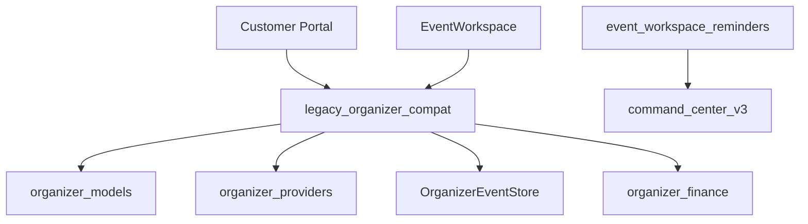
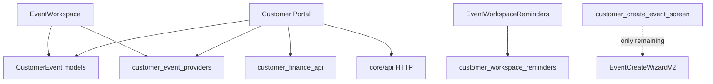

# Phase 42.5 — Legacy Elimination & Event OS Independence

**Status:** Complete  
**Scope:** Remove Customer Portal runtime dependencies on legacy Organizer modules. No features, DB migrations, API changes, navigation changes, or UI redesign.

---

## Objective

Complete Event OS architecture independence: Customer Portal is self-contained at runtime while legacy Organizer code remains in the repository (deprecated, not deleted).

---

## 1. Legacy Dependency Audit

### Before (Phase 42.4)

```
Customer Portal
    │
    ├── legacy_organizer_compat.dart (re-export hub)
    │       ├── organizer_models.dart
    │       ├── organizer_providers.dart
    │       ├── organizer_event_store.dart
    │       ├── organizer_persistence.dart
    │       ├── organizer_finance_*
    │       └── event_create_wizard_v2_screen.dart
    │
    ├── event_workspace_reminders.dart
    │       └── command_center_v3 (providers + widgets)
    │
    └── 20+ files importing compat adapter
```

### After (Phase 42.5)

```
Customer Portal (Event OS)
    │
    ├── models/customer_event_models.dart
    ├── models/customer_finance_models.dart
    ├── models/customer_event_mapper.dart
    ├── api/customer_events_api.dart
    ├── api/customer_finance_api.dart
    ├── providers/customer_event_providers.dart
    ├── providers/customer_finance_providers.dart
    ├── data/customer_event_dev_store.dart (dev only)
    ├── data/customer_event_persistence.dart
    └── providers/customer_workspace_reminders_providers.dart
            └── widgets/workspace/customer_workspace_reminders_panel.dart

Remaining organizer touchpoints (documented):
    ├── customer_create_event_screen.dart → EventCreateWizardV2Screen
    └── legacy_organizer_compat.dart (deprecated, zero references)
```

### Dependency classification

| Dependency | Classification | Resolution |
|------------|----------------|------------|
| `legacy_organizer_compat.dart` | Dead | Deprecated, unreferenced |
| `organizerEventProvider` | Replaceable | → `customerEventProvider` |
| `organizerRevisionProvider` | Replaceable | → `customerEventRevisionProvider` |
| `organizerFinanceApiProvider` | Replaceable | → `customerFinanceApiProvider` |
| `OrganizerEvent` model | Replaceable | → `CustomerEvent` |
| `OrganizerEventStore` (mock) | Replaceable | → `CustomerEventDevStore` (dev only) |
| `OperationsStore` (mock guests/feed) | Temporary | Dev fallback only via `allowMockPersistenceFallback()` |
| `EventCreateWizardV2Screen` | Replaceable | Direct import; wizard migration deferred |
| `CcV3RemindersPanel` | Replaceable | → `CustomerWorkspaceRemindersPanel` |
| `features/organizer/*` (organizer portal) | Required (legacy) | Deprecated; not used by Customer Portal |

---

## 2. Customer Domain Models

Introduced under `mobile/lib/portals/customer/models/`:

| Model | Purpose |
|-------|---------|
| `CustomerEvent` | Canonical managed event |
| `CustomerEventStatus` | Lifecycle enum |
| `CustomerTicketTier` | Ticket configuration |
| `CustomerVendorSlot` | Vendor booking slot |
| `CustomerAttendee` | Guest/attendee record |
| `CustomerEventSummary` | Home / my-events card |
| `CustomerEventFinanceSummary` | Budget / finance KPIs |
| `CustomerFinanceTransaction` | Transaction line items |
| `CustomerWorkspaceReminder` | Planning reminders |
| `customer_event_mapper.dart` | API JSON → `CustomerEvent` |

`WorkspaceSnapshot` remains `EventCommandCenterSnapshot` (uses `CustomerEvent`).

---

## 3. Customer Providers

| Legacy | Event OS replacement |
|--------|---------------------|
| `organizerEventProvider` | `customerEventProvider` |
| `organizerEventsProvider` | `customerEventsProvider` |
| `organizerRevisionProvider` | `customerEventRevisionProvider` |
| `bumpOrganizerRevision` | `bumpCustomerEventRevision` |
| `organizerFinanceApiProvider` | `customerFinanceApiProvider` |
| `organizerEventFinanceSummaryProvider` | `customerEventFinanceSummaryProvider` |
| `customerEventCommandProvider` | Now uses Customer providers internally |
| `eventCommandCenterV3Provider` | `customerWorkspaceRemindersProvider` |

All providers fetch via `CustomerEventsApi` / `CustomerFinanceApi` (core HTTP, no organizer imports).

---

## 4. Compatibility Adapter

`legacy_organizer_compat.dart`:

- Marked `@Deprecated` (Phase 42.5)
- **Zero references** in Customer Portal runtime code
- Removed from `customer_portal.dart` exports
- File retained in repository for reference only

---

## 5. Mock Store Dependencies

| Store | Production path | Dev fallback |
|-------|-----------------|--------------|
| `OrganizerEventStore` | **Not used** | Replaced by `CustomerEventDevStore` |
| `OperationsStore` | API-only (`operationsApiProvider`) | Guest/feed fallback when `allowMockPersistenceFallback()` |
| `VendorStore` | **Not used** in Customer Portal | N/A |

Production paths never touch `OrganizerEventStore`.

---

## 6. Event Workspace Independence

`EventWorkspace` now depends only on:

- `customerEventCommandProvider` → `CustomerEvent`
- `customer_event_models.dart` / `home_hub_models.dart`
- EOS components (`EosSection`, `CelebrationHero`, etc.)
- `EventModuleRegistry` (uses `CustomerEvent`)
- `CustomerWorkspaceRemindersPanel` (no organizer CC V3)

**No Organizer imports in `event_workspace.dart`.**

---

## 7. Deprecation List

| Item | Status |
|------|--------|
| `features/organizer/providers/organizer_providers.dart` | `@Deprecated` library |
| `features/organizer/data/organizer_event_store.dart` | `@Deprecated` library |
| `legacy_organizer_compat.dart` | `@Deprecated` library |
| `CustomerRoutes` | `@Deprecated` (Phase 42.1) |
| `features/organizer/` (module) | Retained; deletion after production release |

---

## 8. Dependency Graph

### Before



### After



---

## Migration Status

| Area | Status |
|------|--------|
| Event models | ✅ Complete |
| Event providers | ✅ Complete |
| Finance providers | ✅ Complete |
| Command center snapshot | ✅ Complete |
| Budget module | ✅ Complete |
| Invitations module | ✅ Complete |
| AI planner module | ✅ Complete |
| Guest module | ✅ Complete |
| Workspace reminders | ✅ Complete |
| Module registry | ✅ Complete |
| Create event wizard | ⚠️ Direct organizer import (documented debt) |
| Organizer module deletion | ❌ Deferred (post-production release) |

---

## Remaining Technical Debt

1. **Event creation wizard** — `CustomerCreateEventScreen` embeds `EventCreateWizardV2Screen` from `features/organizer/wizard_v2/`. Move to `portals/customer/wizard/` in a future phase.
2. **OperationsStore dev fallback** — Guest/feed mock still uses `OperationsStore` when API unavailable and mock flag enabled. Could be replaced with customer-owned ops dev store.
3. **EventsApi core dependency** — `core/api/events_api.dart` still maps to `OrganizerEvent` for legacy organizer portal; Customer Portal uses parallel `CustomerEventsApi`.
4. **Legacy organizer portal** — `/organizer/*` redirects still route through `LegacyOrganizerRouter`; organizer feature module still compiles for compat routes.

---

## Risks

| Risk | Mitigation |
|------|------------|
| Model drift between `CustomerEvent` and API JSON | Shared `mapCustomerEvent` mirrors `mapOrganizerEvent` field parity |
| Wizard still in organizer folder | Isolated single import; documented |
| Dev mock divergence | `CustomerEventDevStore` seeds minimal demo data |
| Finance API duplication | `CustomerFinanceApi` mirrors endpoints 1:1 |

---

## Files Added (Phase 42.5)

```
mobile/lib/portals/customer/models/customer_event_models.dart
mobile/lib/portals/customer/models/customer_event_mapper.dart
mobile/lib/portals/customer/models/customer_finance_models.dart
mobile/lib/portals/customer/models/customer_workspace_reminder_models.dart
mobile/lib/portals/customer/api/customer_events_api.dart
mobile/lib/portals/customer/api/customer_finance_api.dart
mobile/lib/portals/customer/providers/customer_event_providers.dart
mobile/lib/portals/customer/providers/customer_finance_providers.dart
mobile/lib/portals/customer/providers/customer_workspace_reminders_providers.dart
mobile/lib/portals/customer/data/customer_event_dev_store.dart
mobile/lib/portals/customer/data/customer_event_persistence.dart
mobile/lib/portals/customer/widgets/workspace/customer_workspace_reminders_panel.dart
docs/phase42/PHASE42_5_LEGACY_ELIMINATION.md
```

---

## Verification

```bash
cd mobile && flutter analyze
cd mobile && dart analyze lib/portals/customer
cd services/api && npm run build
```

### Checklist

- [x] Customer Portal has no runtime dependency on `legacy_organizer_compat`
- [x] `EventWorkspace` uses only Customer providers/models
- [x] `OrganizerEventStore` not used in Customer Portal (replaced by `CustomerEventDevStore` for dev)
- [x] Mock stores gated by `allowMockPersistenceFallback()`
- [x] Navigation unchanged
- [x] APIs unchanged
- [x] Database unchanged
- [x] Organizer module not deleted
- [x] Deprecation annotations added

---

## Next Steps (post-42.5)

1. Move event creation wizard to Customer Portal
2. Remove `LegacyOrganizerRouter` after production validation
3. Delete `features/organizer/` after successful production release
4. Consolidate `EventsApi` to return neutral DTO or deprecate organizer mapping in core
