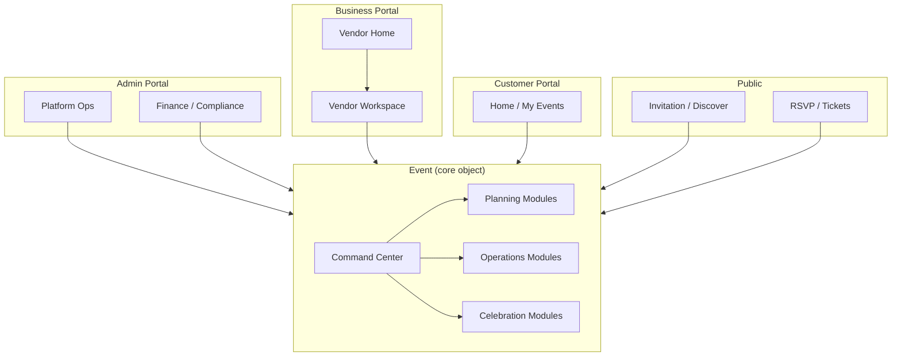

# Owanbe Event Operating System — Product Architecture

**Phase:** 41.6 — Product Unification  
**Date:** 26 June 2026  
**Status:** Canonical architecture blueprint (documentation only)  
**Supersedes:** Ad-hoc portal patterns; informs all work from Phase 42 onward  
**Related:** [`../product_audit/OWANBE_PRODUCT_AUDIT.md`](../product_audit/OWANBE_PRODUCT_AUDIT.md)

---

## 1. Executive Vision

Owanbe is not a marketplace app. It is not an invitation tool. It is not a vendor directory. It is not an admin panel with features bolted on.

**Owanbe is the operating system for events.**

Every celebration — wedding, birthday, corporate gala, owambe, funeral reception, launch party — is a **complex project** with guests, money, vendors, timelines, and emotion. Today that complexity is scattered across WhatsApp groups, spreadsheets, PDF invites, bank transfers, and memory. Owanbe replaces fragmentation with **one living record**: the **Event**.

When an organizer opens Owanbe, they are not “using software.” They are **running an event**. When a vendor opens Owanbe, they are not browsing leads — they are **fulfilling obligations on assigned events**. When a guest receives an invitation, they enter **one celebration** — not a generic website. When finance moves, it moves **on an event ledger**. When admins monitor the platform, they monitor **events in flight**.

The investor story is simple:

> **Airbnb organized stays. Shopify organized stores. Owanbe organizes celebrations.**

The market is enormous, emotionally charged, and underserved by horizontal tools. Owanbe wins by being **vertical, event-native, and Africa-ready** — NGN payments, aso-ebi culture, multi-day programs, vendor ecosystems, and cashless guest experiences in one system.

The product maturity today is **feature-rich but philosophically split**. Phase 41.6 establishes the philosophy that unifies what already works into **one Event Operating System (Event OS)**.

---

## 2. Product Identity

### One sentence

**Owanbe is the operating system for planning, managing, and celebrating events.**

### Why this is true

- **Planning** — budget, guests, vendors, program, seating, website  
- **Managing** — payments, contracts, operations, check-in, incidents, finance  
- **Celebrating** — wall, attire, tickets, public pages, post-event memories  

No module exists for its own sake. Each module answers: *What is happening with this Event?*

---

## 3. Core Product Principles

These principles are **non-negotiable** for all future design and engineering.

| # | Principle | Meaning |
|---|-----------|---------|
| P1 | **Event-first** | Every workflow resolves to an `Event` (or platform scope for admin-only). No orphan screens. |
| P2 | **Command Center is home** | Inside an event, the Command Center is mission control — not a menu of apps. |
| P3 | **Customer-first experience** | The organizer-as-customer path (`/home` → Event → Command Center) is canonical. |
| P4 | **Marketplace serves planning** | Discovery is contextual: *“For this wedding, you still need…”* |
| P5 | **Vendors work through Events** | Vendor home → assigned events → tasks → completion. Not a generic CRM in isolation. |
| P6 | **Admin supervises Events** | Platform health, finance, and compliance drill down to events and tenants. |
| P7 | **Timeline truth** | Every significant action appends to the Event timeline (activity log). |
| P8 | **Finance follows lifecycle** | Draft → committed → captured → settled → reconciled per event. |
| P9 | **One navigation language** | Same back behavior, breadcrumbs, and deep-link rules across portals. |
| P10 | **Guest simplicity** | Guests never see “portals.” They see Invitation → Event → RSVP → Celebration. |
| P11 | **Progressive disclosure** | Planning shows planning modules; Event Day shows operations; Archive shows memories. |
| P12 | **No competing truths** | One dashboard per role at the platform level; one command center per event. |

---

## 4. Event Lifecycle

### Official lifecycle stages

```text
Draft → Planning → Vendor Sourcing → Guest Management → Payments →
Preparation → Event Day → Celebration → Completion → Memories → Archive
```

### Stage definitions

| Stage | User goal | System behavior |
|-------|-----------|-----------------|
| **Draft** | Name the celebration, set date/venue | Event record created; wizard complete |
| **Planning** | Structure the project | Command Center active; progress ring |
| **Vendor Sourcing** | Book services | Marketplace + CRM pipeline + bookings |
| **Guest Management** | Know who is coming | Guests, tiers, invitations, RSVP |
| **Payments** | Collect & pay | Tickets, aso-ebi, rentals, deposits |
| **Preparation** | Finalize run sheet | Program, seating, website, wall |
| **Event Day** | Execute | Check-in, ops, vendor arrivals, live wall |
| **Celebration** | Guest experience | Public pages, tickets, attire, wall display |
| **Completion** | Close the books | Finance reconciliation, vendor completion |
| **Memories** | Preserve | Wall, photos, thank-you (V2) |
| **Archive** | Read-only history | Analytics, export, compliance retention |

### Module → lifecycle mapping

| Module | Primary stage(s) | Route anchor (today) |
|--------|------------------|----------------------|
| Event create wizard | Draft | `/events/create` |
| Customer Command Center | Planning → Preparation | `/events/:id` |
| Budget | Planning → Payments | `/events/:id/budget` |
| Guests | Guest Management | `/events/:id/guests` |
| Invitations / RSVP | Guest Management → Celebration | `/events/:id/invitations`, public token |
| Marketplace (vendors) | Vendor Sourcing | `/vendors`, `/events/:id/vendor-pipeline` |
| Vendor CRM pipeline | Vendor Sourcing | `/events/:id/vendor-pipeline` |
| Rentals | Vendor Sourcing → Preparation | `/events/:id/rentals`, `/vendors/rentals` |
| Aso-Ebi / Attire | Preparation → Celebration | `/events/:id/aso-ebi`, `/events/:id/attire` |
| Program planner | Preparation → Event Day | `/events/:id/program` |
| Seating planner | Preparation | `/events/:id/seating` |
| Event website | Preparation → Celebration | `/events/:id/website` |
| Celebration wall | Celebration → Memories | `/events/:id/wall` |
| Tickets / commerce | Payments → Celebration | `/events/:id/tickets` (public) |
| Event Day / ops | Event Day | `/events/:id/day` |
| Check-in | Event Day | ops API / day screen |
| Finance (organizer) | Payments → Completion | budget + ledger views |
| Vendor orders/catalog | Vendor Sourcing → Completion | vendor portal |
| AI planner (optional) | Planning | `/events/:id/ai-planner` — demote until V2 |
| Organizer CC V3 (legacy) | Planning → Completion | `/organizer/events/:id` — **deprecate** |
| Admin finance/compliance | Completion + platform | `/admin` |
| Launch ops | Platform (all events) | Admin → Launch ops |

---

## 5. Portal Philosophy

### 5.1 Customer Portal (canonical organizer + client)

| Attribute | Definition |
|-----------|------------|
| **Purpose** | Plan and run celebrations |
| **Users** | Event organizers, couples, families, planners (as `client` role) |
| **Entry** | `/` → auth → `/home` |
| **Exit** | Archive event → return to My Events |
| **Primary dashboard** | **Customer Home** — upcoming events, create CTA, quick resume |
| **Relationship to Events** | Home lists Events; selecting one opens **Command Center** |

The Customer Portal **absorbs** the legacy Organizer Portal over time. Organizers are customers who run events.

### 5.2 Business Portal (Vendor)

| Attribute | Definition |
|-----------|------------|
| **Purpose** | Deliver services on assigned events |
| **Users** | Vendors, vendor staff |
| **Entry** | `/vendor` (or `vendors.staging.owanbe.com`) |
| **Exit** | Complete services → return to assigned events queue |
| **Primary dashboard** | **Vendor Home** — today’s events, tasks, requests |
| **Relationship to Events** | **Vendor Workspace per Event** — CRM task, calendar block, orders |

Marketplace profile, catalog, and finance are **business settings**, not the home experience.

### 5.3 Admin Portal

| Attribute | Definition |
|-----------|------------|
| **Purpose** | Operate the platform |
| **Users** | Owanbe staff, finance ops, compliance |
| **Entry** | `/admin` |
| **Exit** | N/A (session-based) |
| **Primary dashboard** | **Launch Operations** (beta) → **Platform Dashboard** (steady state) |
| **Relationship to Events** | Drill-down: Platform → Tenant → Event → Payment/Guest/Vendor |

Admin never plans a wedding. Admin **supervises** events at scale.

### 5.4 Public / Guest surface (not a portal)

| Attribute | Definition |
|-----------|------------|
| **Purpose** | Participate without an account (or minimal account) |
| **Users** | Guests, ticket buyers, wall viewers |
| **Entry** | Invitation link, event URL, `/events` discover |
| **Exit** | RSVP confirm, ticket wallet, wall view |
| **Dashboard** | None — single-event focused pages only |
| **Relationship to Events** | One event per session context |

### 5.5 Super Admin (infrastructure)

Platform configuration (`/super-admin`) — tenants, global config. Rare; not part of daily Event OS narrative.

---

## 6. Dashboard Philosophy

### Current dashboards (audit)

| Dashboard | Exists today | Verdict | Target state |
|-----------|--------------|---------|--------------|
| Customer Home `/home` | Yes | **Keep** | Event launcher + resume last event |
| Customer Command Center | Yes | **Keep — flagship** | Single event mission control |
| Organizer Home `/organizer` | Yes | **Merge → Customer Home** | Deprecate separate organizer shell |
| Organizer CC V3 Workspace | Yes | **Merge → Customer Command Center** | Retire tab workspace |
| Vendor Home `/vendor` | Yes | **Keep** | Refocus on assigned events + tasks |
| Vendor Dashboard (KPIs) | Yes | **Fold into Vendor Home** | One vendor landing |
| Admin Launch Ops | Yes | **Keep (beta)** | First tab during launch |
| Admin Platform Dashboard | Yes | **Keep** | Steady-state exec view |
| Admin Finance | Yes | **Keep** | Platform finance, not event planning |
| Operations Center (admin) | Yes | **Keep** | Cross-event ops |
| Finance dashboards (vendor/org) | Yes | **Keep as modules** | Linked from event or business settings |
| Public Discover | Yes | **Keep** | Marketing/discovery only |

### Final dashboard architecture

```text
CUSTOMER
  Home (events list)
    └── Event
          └── Command Center  ← only "dashboard" inside an event

VENDOR
  Business Home (assigned events + today's tasks)
    └── Event Workspace (vendor view of one event)

ADMIN
  Launch Ops (beta) / Platform Dashboard
    └── Tenants → Events → Event detail (read-only ops)

PUBLIC
  (no dashboard — event pages only)
```

**Rule:** If a screen claims to be a “dashboard” but does not answer *“What events need attention?”* or *“What is the status of this event?”* — merge or remove.

---

## 7. Command Center Philosophy

### Purpose

The **Event Command Center** is the **single source of truth** for one celebration. It is Owanbe’s flagship — the screen investors remember and organizers live in for weeks.

### Layout philosophy

1. **Orientation** — Hero: title, date, venue, countdown  
2. **Progress** — Planning ring: what’s done vs remaining  
3. **Pulse** — At-a-glance KPIs: guests, vendors, budget, tickets  
4. **Modules** — Deep links to specialized tools (not duplicate dashboards)  
5. **Timeline** — Activity feed: single narrative of the event  
6. **Action** — Quick actions + **one** primary “next best step”

### Information hierarchy (top → bottom)

| Layer | Content |
|-------|---------|
| L0 | Event identity + countdown |
| L1 | Planning progress + next task |
| L2 | Summary grid (guests, vendors, budget, tickets) |
| L3 | Module cards (pipeline, program, seating, rentals, celebration) |
| L4 | Activity feed |
| L5 | Quick actions |

### Modules (canonical set)

| Module | Role in CC |
|--------|------------|
| Guests & invitations | Guest Management entry |
| Vendor pipeline | Vendor Sourcing status |
| Budget | Financial planning |
| Program | Run sheet |
| Seating | Layout |
| Rentals & equipment | Logistics |
| Celebration suite | Website, attire, wall |
| Event Day | Operations mode switch |

### Mission Control modes (conceptual — same screen, different emphasis)

| Mode | When | Emphasis |
|------|------|----------|
| **Planning** | Default until T-7 days | Progress ring, marketplace, guests |
| **Preparation** | T-7 to T-1 | Program, seating, vendor confirmations |
| **Event Day** | Day of | Check-in, ops, live wall, vendor arrivals |
| **Post-event** | After | Completion checklist, finance, memories |

**Implementation note (Phase 42+):** Modes are **state-driven UI emphasis**, not separate apps. `/events/:id/day` becomes a focused view of the same event, not a disconnected ops app.

### Anti-patterns to eliminate

- Linking from Customer CC to `/organizer/events/...`  
- “Coming soon” on flagship surfaces (hide until ready)  
- AI planner above checklist (demote to optional assistant)  
- Duplicate ticket management outside commerce module  

---

## 8. Marketplace Philosophy

### Today (directory model)

```text
Category → Vendor list → Profile → Request
```

Works for search. **Fails for planning.** Organizers think: *“What do I still need for my wedding?”*

### Target (event assistant model)

```text
Event (e.g. Wedding)
  └── Planning checklist by need
        ├── Venue
        ├── Decorator
        ├── Photography / Video
        ├── Catering
        ├── Rentals (chairs, tents, sound)
        ├── Aso-Ebi / Attire
        ├── Cake / Pastry
        ├── Entertainment / DJ
        ├── Security / Protocol
        ├── Transportation
        ├── Printing / Invitations (physical)
        ├── Beauty / Makeup
        ├── Cleaning / Post-event
        └── …
```

Each need shows:
- **Status** — not started / requested / booked / paid / complete  
- **Suggested vendors** — from marketplace  
- **Event context** — date, city, guest count, budget band  

### Entry points

| Entry | Behavior |
|-------|----------|
| From Command Center | “Find vendors for this event” → **event-scoped** marketplace |
| From global `/vendors` | Discover → must **attach to an event** before request |
| From vendor pipeline | CRM stage already event-bound |

### Principles

- Marketplace is **not a homepage**. Home is **My Events**.  
- Browse without event only for **exploration**; commit actions require event context.  
- Rentals and Aso-Ebi are **need categories**, not separate products.  
- Trust layer (reviews, verified badges) is V2 — until then, **curated beta vendors**.

---

## 9. Navigation Philosophy

### One standard per role

| Role | Root | Event anchor | Back rule |
|------|------|--------------|-----------|
| Customer | `/home` | `/events/:eventId` | Pop to CC, then My Events, then Home |
| Vendor | `/vendor` | `/vendor/events/:eventId` (target) | Pop to Vendor Home |
| Admin | `/admin` | `/admin/events/:id` (oversight) | Pop within admin shell |
| Public | `/` or invite URL | `/events/:slug` public subpaths | Browser back / event home |

### Deep links

All event module links **must** follow:

```text
/events/:eventId/<module>
```

Never `/organizer/events/...` for customer flows.

### Breadcrumb strategy (conceptual)

```text
Home › My Events › {Event Title} › {Module}
```

On mobile: collapsed to back + title. On desktop: full breadcrumb in shell header.

### Public routes (unchanged scope, unified mental model)

| Path | Public? |
|------|---------|
| `/events/:id` (detail) | Yes |
| `/events/:id/tickets` | Yes |
| `/events/:id/aso-ebi`, `/attire` | Yes |
| `/events/:id/wall/display` | Yes |
| `/events/:id/guests`, `/budget`, etc. | **No** — client auth |

### Never allow

- Competing shells for the same role (organizer vs customer)  
- Cross-role redirects without explicit role switch  
- Staff `?role=` in production user docs  

---

## 10. Information Architecture

### Canonical tree

```text
Owanbe
├── Public
│   ├── Landing
│   ├── Discover events
│   ├── Auth
│   └── Event (public facets)
│       ├── Overview
│       ├── Tickets
│       ├── Attire / Aso-Ebi
│       └── Wall display
│
├── Customer (Organizer)
│   ├── Home
│   ├── My Events
│   ├── Create Event
│   ├── Profile
│   └── Event
│       ├── Command Center  ← hub
│       ├── Guests
│       ├── Invitations
│       ├── Budget
│       ├── Vendor pipeline
│       ├── Marketplace (scoped)
│       ├── Program
│       ├── Seating
│       ├── Rentals
│       ├── Website
│       ├── Wall
│       ├── Attire / Aso-Ebi
│       ├── Event Day
│       └── (Archive — V2)
│
├── Vendor (Business)
│   ├── Home (assigned events)
│   ├── Onboarding
│   ├── Event workspace
│   │   ├── Tasks / CRM
│   │   ├── Calendar
│   │   ├── Orders
│   │   └── Deliverables
│   ├── Catalog
│   ├── Rentals / Attire (vendor)
│   └── Finance
│
└── Admin
    ├── Launch ops / Platform
    ├── Tenants & users
    ├── Events (oversight)
    ├── Vendors
    ├── Operations
    ├── Finance
    ├── Compliance
    └── Audit
```

**Rule:** Every module has **exactly one** parent under `Event` (customer/vendor) or `Platform` (admin).

---

## 11. Module Classification

| Class | Modules | Belongs under |
|-------|---------|---------------|
| **Core** | Auth, Events API, Tenants, Router | Platform |
| **Planning** | Budget, AI planner (optional), Create wizard | Event → CC |
| **Guest** | Guests, Invitations, RSVP, Tiers | Event → CC |
| **Marketplace** | Vendor discovery, CRM pipeline, Requests | Event → CC |
| **Commerce** | Tickets, Aso-Ebi pay, Rentals deposits | Event lifecycle payments |
| **Operations** | Program, Seating, Event Day, Check-in, Incidents | Event → Preparation / Day |
| **Celebration** | Website, Wall, Wall display, Attire | Event → Celebration |
| **Business (vendor)** | Onboarding, Catalog, Calendar, Orders, Vendor CRM | Vendor → Event workspace |
| **Finance** | Ledger, Payouts, Disputes, Wallets | Event + Admin |
| **Admin** | Launch ops, Compliance, Audit, Supervision | Platform |
| **Infrastructure** | Storage, Notifications, Metrics, Quaser | Platform (invisible) |

---

## 12. Feature Rationalization

### Duplicate modules (recommend merge — do not delete yet)

| Duplicate A | Duplicate B | Recommendation |
|-------------|-------------|----------------|
| Customer Command Center | Organizer CC V3 | **CC wins**; V3 becomes read-only redirect |
| Customer Home | Organizer Home | **Customer Home wins** |
| `organizer_persistence` | `EventsApi` + customer flows | API only; remove store fallback |
| `public_event_catalog` | Public events API | API only |
| Ticket management (organizer tab) | Ticket commerce (public + API) | Single commerce module under Event |
| Vendor management (organizer tab) | Vendor pipeline (customer) | Pipeline under Event |
| Attendee management (organizer) | Guests (customer) | Guests under Event |

### Legacy screens (deprecation candidates)

| Path / screen | Status |
|---------------|--------|
| `/organizer/*` shell | Migrate to `/home` + `/events/:id` |
| `event_create_wizard` (v1) | Retire after V2 wizard confirmed |
| `event_workspace_screen` (CC V3) | Redirect to customer CC |
| Gift registry (coming soon) | Hide until V2 |
| Contact import | Frozen — not beta |

### Temporary bridges (remove in Phase 42)

| Bridge | Issue |
|--------|-------|
| CC tickets → `/organizer/events/...` | Portal leak |
| `ALLOW_MOCK_PERSISTENCE_FALLBACK` | Masks API failures |
| `?role=vendor` staff login | Dev-only; not product path |
| Marketplace global without `eventId` | Orphan requests |

### Migration candidates (data / UX, not SQL)

- Organizer role users → default landing `/home`  
- Vendor participations → vendor event workspace  
- Operations store reads → `OperationsApi` only  

---

## 13. UX Consistency Rules

Every Owanbe screen **must** provide:

| Element | Rule |
|---------|------|
| **Primary action** | One obvious button (EOS emphasis style) |
| **Secondary action** | Outlined or text; never compete with primary |
| **Help** | Context subtitle or `?` for complex modules |
| **Back** | Always returns up the IA tree — never random role home |
| **Search** | Marketplace, guest list, admin tables only |
| **Cards** | `EosSurfaceCard` or `EosKpiCard` — no raw Material cards |
| **Spacing** | `context.eos.spacing.*` only |
| **Loading** | Skeleton on dashboards; spinner on short fetches |
| **Empty state** | `EmptyStateCard` with action — never blank screens |
| **Errors** | Human message + `request_id` for support — never raw exceptions |

### Copy tone

- Warm, clear, Nigerian-friendly English  
- Avoid jargon (“ledger”, “tenant”) in customer UI  
- Use “celebration”, “guests”, “vendors”, “big day”  

---

## 14. Event Operating System Blueprint



### ASCII summary

```text
                    ┌─────────────┐
                    │   EVENT     │
                    │  (record)   │
                    └──────┬──────┘
           ┌───────────────┼───────────────┐
           ▼               ▼               ▼
    ┌────────────┐  ┌────────────┐  ┌────────────┐
    │  Customer  │  │   Vendor   │  │   Admin    │
    │ Command    │  │ Workspace  │  │ Oversight  │
    │  Center    │  │ per event  │  │ per event  │
    └────────────┘  └────────────┘  └────────────┘
           │               │               │
           └───────────────┴───────────────┘
                           │
              Guests · Money · Timeline · Vendors
```

**Finance spine:** Payment → Event ledger → Vendor settlement → Admin reconciliation — always keyed by `event_id`.

**Guest spine:** Invitation token → Event → RSVP status → Check-in → Wall.

---

## 15. Migration Roadmap (documentation only)

| Phase | Name | Goal |
|-------|------|------|
| **42** | Portal Unification | One customer path; retire organizer shell; fix CC links; mock elimination P40.3–P40.8 |
| **43** | EOS Polish | Design system enforcement; errors; empty states; Command Center modes |
| **44** | Production Hardening | Staging TLS; Quaser cert; performance baselines; alerts |
| **45** | Private Beta | ≤50 organizers; 48h soak; launch ops monitoring; curated vendors |
| **46** | Public Launch | Open beta; marketplace trust V2; scale infra; FCM optional |

### Phase 42 — Portal Unification (engineering blueprint)

- Canonical routes under `/events/:id/*`  
- Redirect `/organizer` → `/home`  
- Merge dashboards per Section 6  
- Event-scoped marketplace requests  
- Remove mock persistence from production paths  

### Phase 43 — EOS Polish

- Top 30 screens EOS compliance  
- Command Center mode switching  
- Marketplace “needs checklist” UX (no new backend categories required for MVP)  
- Hide incomplete modules  

### Phase 44 — Production Hardening

- Execute Phase 41 certification on staging  
- GO/NO-GO from CONDITIONAL → GO  
- Load tests; Grafana  

### Phase 45 — Private Beta

- Invite-only cohort  
- Human support playbook  
- Weekly launch ops review  

### Phase 46 — Public Launch

- Marketing site alignment with Event OS story  
- Reviews/trust layer (designed, not frozen scope today)  
- Multi-region if needed  

---

## 16. Success Criteria

Phase 41.6 succeeds when the organization can answer **yes** to:

| # | Criterion |
|---|-----------|
| 1 | Every workflow has **one obvious path** documented in this architecture |
| 2 | Every portal has **one purpose** (Customer / Business / Admin / Public) |
| 3 | Every platform-level dashboard has **one reason to exist** |
| 4 | Every module maps to **one Event lifecycle stage** |
| 5 | A first-time Nigerian organizer understands: *Home → Event → Command Center* in **under 3 minutes** |
| 6 | The product is described as **one Event Operating System**, not “many apps” |
| 7 | Phase 42 engineering can proceed **without product ambiguity** |

---

## Appendix A — Glossary

| Term | Definition |
|------|------------|
| **Event** | The core domain object — one celebration project |
| **Command Center** | Event-scoped mission control UI |
| **Customer Portal** | Organizer + client experience (`/home`) |
| **Business Portal** | Vendor experience (`/vendor`) |
| **Event OS** | The unified philosophy: all workflows orbit Events |
| **EOS** | Event Operating System design system (UI) |

## Appendix B — Explicit non-goals (feature freeze)

EventBook · Reviews · Ratings · Social graph · Advanced AI · New marketplace categories · Chat · Gamification · Community — all **post-launch V2** unless beta blockers.

---

*This document is the single source of truth for product architecture. No code was written. No commits were made.*
