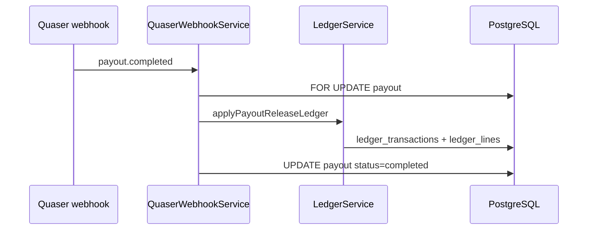
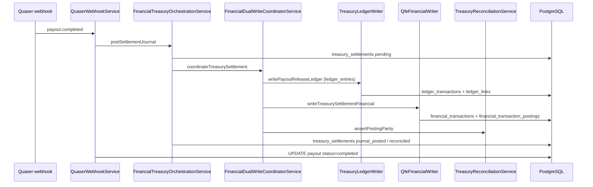

# Sprint S5 — Treasury Settlement Dual-Write

Migrates **only** `FinancialTreasuryOrchestrationService.postSettlementJournal` through `FinancialDualWriteCoordinatorService` on the treasury payout-completion path (`payout.completed` / `payout.succeeded` webhooks).

Payment capture, card rail, transfers, and virtual accounts are unchanged.

## 1. Files changed

| Path | Role |
|------|------|
| `infra/db/015_qfe_treasury_dual_write.sql` | `financial_transactions`, `financial_transaction_postings`, `treasury_settlements` |
| `services/api/src/modules/qfe/*` | QFE coordinator, treasury orchestration, writers, reconciliation |
| `services/api/src/modules/payments/quaser-webhook.service.ts` | Payout completion → `postSettlementJournal` only |
| `services/api/src/modules/payments/payments.module.ts` | Imports `QfeModule` |
| `services/api/src/config/env.schema.ts` | `QFE_DUAL_WRITE_TREASURY` |
| `services/api/src/config/configuration.ts` | Flag wiring |
| `services/api/test/financial-treasury-dual-write.spec.ts` | Coordinator unit tests |

**Not modified:** `PaymentsService`, transfer/card/VA services, payment capture webhook path.

## 2. Before / after sequence

### Before (S4 legacy)



### After (S5, flag on)



With `QFE_DUAL_WRITE_TREASURY=false`, steps after `writePayoutReleaseLedger` are skipped (legacy-only).

## 3. Idempotency strategy

| Layer | Key | Behavior |
|-------|-----|----------|
| Payout webhook | `payout.status = completed` | Early ack on duplicate delivery |
| Treasury settlement | `settlement_reference` = `treasury_settlement:{payout_id}` | Unique on `(tenant_id, settlement_reference)`; `treasury_settlements` row per payout |
| Legacy ledger | `payout_release:{payout_id}` | Existing `ledger_transactions` ON CONFLICT + line count guard |
| QFE financial | Same as settlement reference | `financial_transactions` ON CONFLICT; postings inserted only when count = 0 |

Duplicate webhook: payout already `completed` → skip before journal. Journal replay: ledger and QFE upserts are no-ops; treasury row `journal_posted` / `reconciled` → `skipped: already_posted`.

## 4. Reconciliation strategy

- **Inline (dual-write on):** `TreasuryReconciliationService.assertPostingParity` compares debit/credit totals on `ledger_lines` (ledger_entries) vs `financial_transaction_postings` for the linked `financial_transaction_id`.
- **On mismatch:** Inserts `reconciliation_reports` (`amount_mismatch`, critical) with `classification: qfe_treasury_dual_write_mismatch`; marks `treasury_settlements.status = mismatch`; commits the evidence while leaving payout uncompleted for investigation.
- **Operational:** Existing `ReconciliationService.runLedgerPaymentConsistencyCheck` remains for payment capture; treasury-specific jobs can filter `treasury_settlements` + `financial_transactions` by `kind = treasury_settlement`.

## 5. Rollback plan

1. Set `QFE_DUAL_WRITE_TREASURY=false` (default) and redeploy — only legacy ledger + treasury status rows without QFE postings.
2. No migration rollback required for flag-off; QFE tables are additive.
3. If a bad dual-write deploy slipped through: flag off, fix data via reconciliation reports, optionally backfill `financial_transactions` from `ledger_lines` in a one-off job (out of scope here).

## 6. Test plan

| Test | Type | Expectation |
|------|------|-------------|
| `financial-treasury-dual-write.spec.ts` | Unit | Flag off → no financial writer; flag on → dual-write + parity |
| Payout webhook idempotency | Integration (existing pattern) | Second `payout.completed` → duplicate ack, single ledger txn |
| Dual-write parity failure | Integration | Force mismatched posting → rollback, payout not completed |
| Migration apply | SQL | `015_qfe_treasury_dual_write.sql` on staging DB |

Run unit tests:

```bash
cd services/api && npm test -- financial-treasury-dual-write.spec.ts
```

## 7. Verification checklist

- [ ] Apply `infra/db/015_qfe_treasury_dual_write.sql`
- [ ] `QFE_DUAL_WRITE_TREASURY=false`: payout completion still posts `ledger_lines` and completes payout
- [ ] `QFE_DUAL_WRITE_TREASURY=true`: same payout also creates `financial_transactions` + postings with matching totals
- [ ] Duplicate `payout.completed` webhook does not double-post ledger or QFE
- [ ] `treasury_settlements.settlement_reference` stable per payout
- [ ] Payment capture webhook unchanged (no QFE on `payment.captured`)
- [ ] `PaymentsService` / transfer / card / VA code paths untouched

## Configuration

```env
QFE_DUAL_WRITE_TREASURY=false   # safe default
# QFE_DUAL_WRITE_TREASURY=true  # enable dual-write in staging first
```
